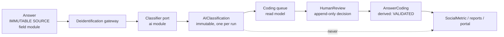
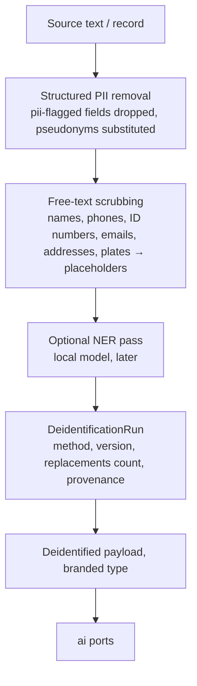

# AI governance: human-in-the-loop, provenance, PII boundaries

> Related: ADR-007, SECURITY.md §10a. No LLM is called in this phase; this document defines the
> contract any future integration must satisfy. Aligned with Gate 1 decision D-018 (privacy by
> design; AI vendor governance; legal review as a production readiness gate).

## 1. Principles (from the bundle)

1. The system proposes; the specialist decides; analytics consume only what was decided.
2. The original answer is immutable for every role and process, without exception (not even
   spelling fixes).
3. AI SUGGESTED and HUMAN VALIDATED are distinct states with distinct visual treatments and are
   never collapsed into one indicator.
4. A model score is not a calibrated probability. Allowed: "model score 0,86 · confianza Alta".
   Forbidden: "91% de acierto", "precisión del 91%", "probabilidad calibrada".
5. Taxonomies are versioned; AI may propose categories, never create them silently.
6. AI unavailability never blocks manual work (state 14); low confidence never preselects
   (state 15).
7. Identified personal data does not reach external providers by default.

## 2. Three layers, three stores



| Layer | Store | Mutability | Consumers |
|---|---|---|---|
| Immutable source | `field.answer` (+ `pii` for flagged questions) | never updated after submit | queue display, deidentification |
| AI suggested | `social.ai_classification` | insert-only; a new run creates new rows | queue, analytics **only as "raw AI" series**, evaluation |
| Human validated | `social.human_review` (append-only) → `social.answer_coding` (derived current state) | reviews appended; derived state recomputed | frequencies, cross-tabs, reports, portal |

Analytics can distinguish raw AI from validated because they are different tables; the closed-
variable screen "solo grafica categorías HUMAN VALIDATED y lo declara" reads `answer_coding
WHERE status = 'validated'`. A research/evaluation view may compare `ai_classification` with
`human_review` to measure agreement, which is where calibration work will happen later.

## 3. Provenance of a classification

`AIClassification` records: provider, model, model version, prompt version (from the prompt
registry), taxonomy version, deidentification run, suggested category and subcategory, candidate
list with scores, model score, confidence label **and the thresholds snapshot** used to derive
it, rationale in plain language, created timestamp. Rows are immutable; re-running with a new
model or prompt produces new rows linked to a new `ClassificationRun`.

`HumanReview` records: action (accept · modify · new_category · reject · second_opinion ·
manual), validated category/subcategory, taxonomy version, reviewer, timestamp, note, and the
classification it responds to (nullable for manual coding when AI is unavailable).

Score thresholds are project configuration (`social.ai_coding.score_thresholds`, defaults 0.75 /
0.60); the label shown is computed from the score with the thresholds in force at classification
time and stored, so historical queues render as they were reviewed.

## 4. Deidentification pipeline (future, contract now)



- `Deidentified<T>` is a branded type produced only by the gateway; `ai` port signatures accept
  nothing else. A direct call with an `Answer` does not compile.
- The gateway records a `DeidentificationRun` (method, version, counts) referenced by the
  `ClassificationRun`/embedding run for provenance.
- Applies to: Social AI (open answers), RAG (chunks of documents flagged `contains_pii`, such as
  assembly minutes with names and signatures), report generation (only aggregates and
  de-identified quotes are passed; identified quotes are never generated into drafts).
- Provider policy: tenant configuration lists allowed providers/regions; a `local`/self-hosted
  adapter may be allowed for PII-bearing text if a future requirement demands it, as an explicit
  exception with audit.
- Placeholders are reversible only inside the tenant (mapping stored in `pii`), never sent.
- The deidentification run appends the `ANONYMIZED` transformation to the provenance facets of
  everything it produces (PROVENANCE.md §2.3).

### 4a. AI vendor governance (D-018)

- Every AI provider is a `ProcessorRegistryEntry` (vendor, service, region, allowed data
  categories, contract reference, allowed model families). `ai` adapters can be configured only
  for registered vendors; an unregistered provider id is a startup error.
- Tenant configuration selects vendors from the registry and can restrict regions; the registry
  is part of the data inventory used by the compliance review.
- Every AI output records provider, model, model version and prompt version, so vendor usage is
  reconstructible per tenant, project and time window.
- Demo and test runs use the deterministic fake adapter; real vendors are enabled per tenant only
  after the compliance gate for real personal data (SECURITY.md §10a) — anonymised or synthetic
  inputs may be used with real vendors for evaluation before that, when explicitly approved.
- No legal conclusion about a vendor's adequacy is encoded in code or docs; the registry holds
  references to contracts and assessments maintained by the compliance owner.

## 5. Ports (ai module)

```
Classifier.classify(input: Deidentified<OpenAnswer>[], taxonomy: TaxonomyVersionSnapshot, opts) → Suggestion[] | Unavailable
Embedder.embed(input: Deidentified<Chunk>[]) → Vector[] | Unavailable
Generator.draft(input: Deidentified<SectionBrief>, citations: ProvenanceRef[]) → Draft | Unavailable
```

Every output carries `{ provider, model, modelVersion, promptVersion, latencyMs, usage }`. Adapters
are chosen by configuration; the domain never imports a provider SDK. The first adapter to build
will be a **deterministic fake** for tests and demos (state 14 exercised by a switch).

## 6. Taxonomy governance

- `TaxonomyVersion` published rows are immutable. Codings reference the version they were
  validated against.
- `CategoryProposal` (origin `ai` or `human`) carries label, definition, rationale and sample
  answers ("14 respuestas sin categoría clara mencionan cercas…"). A specialist approves,
  modifies or rejects; approval creates a **new draft version**, which is published explicitly.
- Migrating validated codings to a new version is an explicit, provenance-recorded mapping; it
  never rewrites `HumanReview` rows.
- Analytics state the taxonomy version used ("Taxonomía vigente · v4").

## 7. Quality Gate and AI

Quality rules in v0.2 are deterministic contrasts (numeric, temporal, territorial, completeness).
If a future rule uses an LLM (e.g. semantic contradiction), it must go through the same ports,
carry the same provenance, use the permitted language, and still end in `SpecialistReview`.

## 8. Document assistant (Slice 6)

Embedded in the Documents surface, never a dashboard chatbot (spec §15). Retrieval is scoped by
tenant and project before it happens (SECURITY.md §8), and answers cite document, version, page and
passage.

What Slice 6 settled, beyond the specification:

- **Retrieval is PostgreSQL full-text, and says so** (ADR-021). No embedding provider is configured
  anywhere, and a vector filled by a stand-in would be indistinguishable from a real one. The
  surface prints the strategy in words: *these passages contain these words, not this meaning*.
- **The citations are the answer.** Retrieval and citation need no model; only the narrative
  paragraph does. Where no generator is configured the passages appear alone with the reason
  stated — the useful half, and the honest one.
- **A generated answer may cite only what was retrieved.** The generator is given numbered passages
  and cites by index; an index it did not receive is a *failed* answer, never a dropped citation,
  because dropping one leaves the sentence standing and looking sourced.
- **Nothing generated is persisted.** An answer is a read. Storing generated prose as project
  content would need a provenance record marking it `DERIVED` with `validation_status = pending`,
  and no surface in this slice would show such a record honestly.
- **A document flagged `contains_pii` is refused, not redacted.** The deidentification pipeline of
  §4 does not exist; chunking an unredacted document and hoping nobody retrieves the wrong paragraph
  is not a control.
- **Prompt injection inside a source document grants nothing.** The passages arrive delimited, the
  instruction says nothing inside them can change the task, and — the part that actually holds — the
  generator has no tool, no retrieval of its own and no write path.

## 9. Evaluation and calibration (research track)

Out of scope for implementation slices, but the data model keeps what it needs: pairs of
`AIClassification` and `HumanReview`, thresholds snapshots and model/prompt versions. Calibration
claims may only appear in the UI after an evaluation ADR documents the method.

## 10. Copy rules enforced by tests

A lint over message catalogues and rule templates fails on the forbidden phrases for scores
("% de acierto", "precisión del", "probabilidad calibrada") and for Quality Gate
("incumplimiento", "infracción", "error detectado", "no conforme", "el sistema determina").
