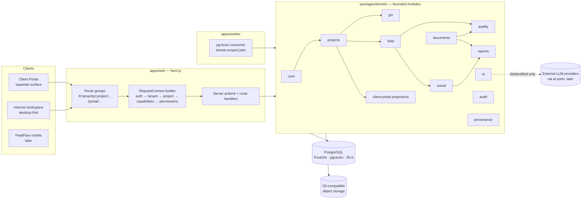

# EIA Studio — Architecture

> Phase: architecture only. Nothing here is implemented. Decisions with lasting consequences are
> recorded in `docs/DECISIONS/ADR-*.md`; this document is the map. Gate 1: approved with
> conditions (see `docs/DECISIONS/GATE-1.md`); aligned with D-013 (faceted provenance), D-014
> (boolean capabilities), D-016 (Better Auth scope), D-017 (hosting deferred, persistent worker).
> Implementation Gate 0 hardening applied: ADR-015 (domain purity / application layer), IG0-B01
> (privileged helper contract in ADR-004), IG0-H02 (capability truth table in FEATURES.md §3).

## 1. Architectural style: modular monolith

One deployable web application (Next.js) plus one background worker process, both built from the
same TypeScript monorepo and the same domain packages. Modules are separated by package boundaries
and lint rules, not by network. Reasons:

- one team, one product, one database: microservices would multiply tenancy, auth and provenance
  enforcement surfaces without any scaling need;
- the hardest requirements (tenant isolation, provenance, human-in-the-loop) are cross-cutting and
  are simpler to enforce in one process with one transaction boundary;
- module boundaries are still explicit so that a module (e.g. `ai`, heavy GIS processing) can
  later be extracted if it needs a different runtime.



## 2. Bounded modules

Modules live under `packages/domain/<module>/` (pure rules) with their persistence-facing
use-cases under `packages/application/<module>/` (ADR-015: the domain never imports `@eia/db`).
Each module exposes a **public API** (`index.ts`) of use-cases and read models; other modules may
import only that. Tables are owned by exactly one
module; cross-module reads go through the owner's read models or through explicitly published
events, never through foreign joins.

| Module | Owns | Depends on | Notes |
|---|---|---|---|
| `core` | User, Tenant, TenantMembership, Role, Permission, Capability catalogue + resolution, Configuration registry, RequestContext, error types | — | No domain knowledge of EIA. |
| `projects` | Project, ProjectMembership, ProjectProfile, ProjectCapabilitySetting, ProjectConfiguration, ProjectUnit, Milestone, Deliverable, ActivityEvent, ForecastSnapshot, KPI read models | core, provenance | Command Center and Portfolio read models live here. |
| `documents` | SourceDocument, DocumentVersion, DocumentChunk, document viewer locators, object storage keys for documents | core, projects, provenance | RAG chunks are owned here; embeddings are produced by `ai` on request. |
| `gis` | SpatialDataset, SpatialDatasetVersion, Layer, Parcel, ParcelGeometry, LinearReference (extension), Road/Alignment (extension), Affectation (extension), map read models | core, projects, provenance | Parcel is core to this module even though profiles decide which extension attributes exist. |
| `field` | Assignment, Visit, Device, SurveyTemplate, SurveyVersion, Question, SurveyInstance, Answer, Media, field inbox read model, sync protocol (later) | core, projects, gis (Parcel id only), provenance | Answers are immutable after submission. |
| `social` | Taxonomy, TaxonomyVersion, Category, CategoryProposal, ClassificationRun, AIClassification, HumanReview, AnswerCoding (derived), SocialMetric, analytics read models | core, projects, field (validated answers read model), ai (port), provenance | Analytics consume only HUMAN VALIDATED codings. |
| `quality` | Requirement (rule catalogue), QualityRun, QualityFinding, FindingEvidence, SpecialistReview | core, projects, documents, gis, field, social (read models only), provenance | Rules are pluggable; evidence references are typed locators, not FKs to every table. |
| `reports` (later) | GeneratedReport, ReportVersion, GeneratedSection, citations | core, projects, documents, social, quality, ai, provenance | Every number in a report snapshots a provenance id. |
| `client-portal` | PortalPublication, portal read models/DTOs, ClientPortalGrant | core, projects (publish input), provenance | Separate security surface; reads only its own projection tables at request time. |
| `ai` | Provider ports (classify, embed, generate), adapters, prompt registry, deidentification gateway, model/prompt version records | core, provenance | Never imports PII types; accepts only `Deidentified<T>` inputs. |
| `provenance` | ProvenanceRecord, ProvenanceInput (lineage), ImportRun, CalculationRun, source-type and regime vocabularies | core | Cross-cutting; every other module depends on it. |
| `audit` | AuditLog (append-only), audit emitters, export logging | core | Consumed by security features; never exposed to the portal. |

Dependency rules (enforced by ESLint boundaries + package.json):

- `core` and `provenance` depend on nothing else.
- Nobody imports `client-portal` except `apps/web` portal routes; `client-portal` imports read
  models from `projects` only at **publish time**, never at request time.
- `ai` may be imported only by `social`, `documents`, `reports` and `quality` through its ports.
- `apps/*` import module public APIs; they never import `packages/db` tables directly.

### 2.1 Why not the proposed list verbatim

The brief proposed `core/ projects/ gis/ field/ social/ quality/ documents/ reports/
client-portal/ ai/ audit/`. Two changes:

- `provenance` is promoted to its own module because every module writes provenance and the
  vocabulary must be defined once (ADR-005).
- "road" is **not** a module. Road-specific concepts (alignment, segment as a unit kind, linear
  reference, affectation) are an **extension of `gis` and `projects` activated by the profile**,
  not a top-level module. A top-level `road` module would make the core assume roads; a fully
  generic "unit of analysis" meta-model would be the other extreme (ADR-003).

## 3. Request lifecycle and context

Every internal request follows the same pipeline, executed server-side:

1. **Authenticate**: session → `userId` (Better Auth handles identity, authentication and
   sessions only; it is not the authorization system, ADR-010).
2. **Resolve tenant** from the URL segment (`/t/:tenantSlug`), verify an active
   `TenantMembership` exists for the user. Otherwise `permission denied` state (never reveal
   whether the tenant exists).
3. **Resolve project** from `/p/:projectSlug` when present; verify `ProjectMembership` is linked to
   that tenant membership. Otherwise `permission denied`.
4. **Resolve capabilities**: `PRODUCT_AVAILABLE ∧ TENANT_ALLOWED ∧ PROJECT_EFFECTIVE_ENABLED ∧
   DEPENDENCIES_SATISFIED` for each key (ADR-002, FEATURES.md §3) → `CapabilitySet` of booleans. Navigation
   presentation (ACTIVE / ANNOUNCED / HIDDEN) is computed separately by the shell and never used
   for authorization.
5. **Resolve permissions**: tenant role + project role → `PermissionSet`.
6. Build an immutable `RequestContext { userId, tenantId, projectId?, tenantRole, projectRole?,
   capabilities, permissions, requestId, locale }`; stored in `AsyncLocalStorage`, passed
   explicitly to use-cases.
7. Every DB access opens a transaction that sets `app.tenant_id`, `app.project_id`, `app.user_id`
   as local settings; Row Level Security uses them (ADR-004).
8. Use-case checks `requireCapability(...)` and `requirePermission(...)` first; layouts hide what
   is not allowed, but hiding is never the authorization.

Client Portal requests follow a separate pipeline (`/portal/...`), with a separate DB role and a
separate context type (`PortalContext`) that cannot be passed to internal use-cases (ADR-009).

## 4. Routing and shell

Invariant 1: every internal route is `:tenant/:project/...`. Proposed route groups (Next.js App
Router; path shapes, not files):

```
/login, /invite/[token]                       auth surface
/t/[tenant]                                   Portfolio (tenant scope)
/t/[tenant]/settings/(users|roles|modules|templates|security|integrations|branding)
/t/[tenant]/p/[project]                       Command Center
/t/[tenant]/p/[project]/gis                   GIS / Parcel Explorer (map+table+panel)
/t/[tenant]/p/[project]/parcels/[parcelCode]/(summary|visits|instruments|affectations|media|quality)
/t/[tenant]/p/[project]/field                 Field Surveys inbox
/t/[tenant]/p/[project]/social/(variables|open|taxonomy)
/t/[tenant]/p/[project]/quality[/[findingId]] list → in-place detail
/t/[tenant]/p/[project]/documents             (later)
/t/[tenant]/p/[project]/reports               (later)
/t/[tenant]/p/[project]/settings/(modules|configuration|members)
/portal/[tenant]/[project]                    Client Portal (separate layout, separate auth)
/states                                       state gallery (dev/design only, not shipped to tenants)
```

State mapping from the prototype (README "State Management"): `screen`/`tab` → routes;
`selected`, `qIdx`, `prov` → view state (URL search params where shareable: `?parcel=`,
`?prov=`); `validated` → persisted mutations (HumanReview rows).

Command palette, rail and breadcrumb all resolve to these routes; the route list is generated from
the capability catalogue so that a disabled capability has **no route** (not a 404 page: a
`feature disabled` state rendered only when reached by direct link).

## 5. Data layer

- **PostgreSQL** with **PostGIS** (geometry), **pgvector** (embeddings), **Row Level Security** on
  every tenant-owned table; application role without BYPASSRLS; migrations role separate.
- Schemas: `app` (operational), `pii` (identified personal data, stricter grants), `portal`
  (publication projections, read by the portal role), `audit` (append-only), `vec`
  (chunk embeddings, same RLS predicates).
- Identity: UUID v7 primary keys everywhere; business identifiers (`parcel_code`, finding ids like
  `QG-014`, answer ids like `R-0118`) are unique per project and are never primary keys.
- Every tenant-owned table: `tenant_id NOT NULL`, and `project_id NOT NULL` where project-scoped,
  with composite foreign keys `(tenant_id, project_id)` → `project` so a row cannot reference a
  project of another tenant even if application code is wrong.
- Provenance: single `provenance_id` FK on provenance-bearing tables (ADR-005).
- Object storage keys are tenant/project prefixed; the DB stores keys, never public URLs.

## 6. Background jobs

`apps/worker` is a **persistent worker process** (Gate 1 D-017): a long-running Node process
consuming a Postgres-backed queue (pg-boss), deployable as a container on any reasonable
provider. Workloads such as GIS imports, document processing, quality runs, classification
batches, retention sweeps and PDF rendering must not be assumed to fit inside ephemeral
serverless request limits. Rules:

- every job payload carries `{ tenantId, projectId?, actorUserId | system }` and a `runId`;
- the worker builds a `JobContext` equivalent to `RequestContext` and opens its DB transaction
  with the same RLS settings; a job can therefore not read another tenant's rows;
- jobs are idempotent by key (`ImportRun.id`, `QualityRun.id`, `ClassificationRun.id`);
- long GIS imports and document processing stream to object storage and write progress into the
  run row, feeding the `syncing`/`loading` states.

## 7. GIS

- MapLibre GL in the client; layers come from server endpoints scoped by context: GeoJSON for
  small project layers, `ST_AsMVT` tiles when a project exceeds a threshold.
- Geometry stored in EPSG:4326; metric computations (areas, abscissa projection) use the
  **project's configured CRS** (`projects.crs`, a configuration value, e.g. a UTM zone) — never a
  hardcoded zone.
- Every layer has a `SpatialDatasetVersion` with layer provenance (`REAL_BASE_MAP`,
  `RECONSTRUCTED_ALIGNMENT`, `SYNTHETIC_PARCELS`, later `OFFICIAL_IMPORTED_ALIGNMENT`,
  `OFFICIAL_CADASTRE`), rendered by the mandatory legend.
- Selection state (map ↔ table ↔ panel) is one client store keyed by parcel id.

## 8. Cross-cutting concerns

| Concern | Mechanism |
|---|---|
| Authorization | `core/authz`: typed permission catalogue, role → permissions, `requirePermission(ctx, key, resource)`; policies for row-level checks (e.g. PII) |
| Capabilities | `core/capabilities`: catalogue + `resolveCapabilities()`; `requireCapability(ctx, key)` in every server action/handler/job (ADR-002) |
| Configuration | `core/config`: zod schema registry keyed by capability; tenant defaults + project overrides; typed getters (FEATURES.md) |
| Provenance | `provenance` module with four facets (regime, origin, transformations, granularity); UI `ProvenanceDrawer` reads one `provenance_id`; the v0.2 SOURCE TYPE badges are derived labels (ADR-005, D-013) |
| Regime (historical/live/demo) | a facet on `ProvenanceRecord`; read models return `{value, provenance facets, provenanceId}` (PROVENANCE.md) |
| Privacy by design | inventory, purpose, retention, processor registry, consent/legal-basis and risk-assessment metadata (SECURITY.md §10a, D-018); legal review is a production readiness gate |
| PII | `pii` schema, `pii.read`/`pii.export` permissions, deidentification gateway before `ai` (SECURITY.md, AI_GOVERNANCE.md) |
| Audit | append-only `audit.log`, written in the same transaction as the mutation, includes tenant/project/actor/action/object/reason |
| Errors | typed domain errors → mapped to the 15 system states on the client (`FeatureDisabled`, `PermissionDenied`, `NoProjectSelected`, `AiUnavailable`, …) |
| i18n | message catalogue (`es-EC` default), copy of the 15 states and Quality Gate language rules stored as assets and linted for forbidden words |
| Observability | OpenTelemetry traces with `tenant.id`, `project.id`, `request.id` attributes (never PII); structured logs (pino) with redaction; error tracking with scrubbing |

## 9. Technology direction and evaluation

Preferences given: Next.js, TypeScript, PostgreSQL, PostGIS, MapLibre, S3-compatible storage,
pgvector; Python only when it provides clear value. Recommendations below are to be confirmed at
Slice 0 against current library status; nothing is installed in this phase.

| Area | Recommendation | Alternatives considered | Trade-offs |
|---|---|---|---|
| Package manager | **pnpm** (workspaces, strict hoisting) | npm, yarn, bun | pnpm's strictness catches phantom dependencies across packages; bun is fast but its workspace/lockfile story is less mature for a multi-year product. |
| Repository | **pnpm monorepo + Turborepo**: `apps/web`, `apps/worker`, `packages/*` | single Next.js app with `src/modules` | Packages make module boundaries real (a module cannot import a sibling's internals) and let the worker share domain code without a second build. Cost: more config; acceptable. Start with few packages; promote modules to packages only when boundaries need enforcing. |
| Layering | **`@eia/domain` pure, `@eia/application` orchestrates, `@eia/db` adapts** (ADR-015); enforced by ESLint and a purity unit test | ports in the domain with a unit-of-work abstraction | Option A moves existing orchestration instead of inventing interfaces; keeps one transaction per use-case. |
| ORM / query layer | **Drizzle ORM only** + reviewed SQL where needed (ADR-013); Prisma is not added alongside | Prisma, Kysely, TypeORM | Drizzle is SQL-first, supports transactions with `SET LOCAL` (RLS), custom column types for PostGIS/pgvector, and generates readable migrations. Prisma's engine model makes RLS-per-transaction and PostGIS awkward and a second ORM would split the schema and migration history. Kysely is a fine query builder but no schema/migration tooling. |
| Migrations | drizzle-kit for schema diff + **hand-written SQL migrations** for RLS policies, functions, triggers, PostGIS/pgvector indexes, all in one ordered folder applied by one runner | Flyway/graphile-migrate | Policies must be code-reviewed SQL, not inferred. One runner avoids two migration histories. |
| Validation | **Zod** everywhere (server actions, route handlers, forms, config schemas, fixture manifests, portal DTO allowlists) | Valibot, TypeBox | Ubiquity and inference; `strict()` objects prevent mass assignment. |
| Authentication | **Better Auth**, approved provisionally at Gate 1 (D-016, ADR-010) for identity, authentication and session management **only**; memberships, roles, permissions and the capability resolver are EIA Studio domain concepts and are never derived from Better Auth organisation roles | Auth.js, Clerk, Lucia-style custom, Keycloak | Needs: email+password/magic link, mandatory 2FA for OWNER/ADMIN/COORDINATOR, later SAML SSO (integrations list), external client users, data control (Ecuador's data-protection law). Clerk is fastest but hosted per-MAU pricing and external client users complicate it; Auth.js lacks orgs/2FA out of the box; Keycloak is heavy. Provisional: revisit if the library's maturity or plugin scope proves insufficient during Slice 0. |
| Authorization | **Own typed policy layer** in `core/authz` (permission keys as data, roles as sets, resource policies as functions), audited | CASL, OpenFGA/Zanzibar, Permit.io | Our model is two-level (tenant/project) with a small fixed role set; a relationship-based engine is overkill and adds an external dependency in the isolation path. CASL could wrap it later for the client. |
| RLS integration | Transaction-per-request with `SET LOCAL app.*`; `eia_app` role without BYPASSRLS; `eia_portal` role limited to `portal` schema; policies deny when settings are missing | Schema-per-tenant, database-per-tenant | Shared schema + RLS is the right cost/isolation point for hundreds of tenants; schema-per-tenant complicates migrations and pgvector/PostGIS indexes; database-per-tenant is an option for a future "dedicated" plan (ADR-001/004). |
| Job queue | **pg-boss** | Graphile Worker, BullMQ (Redis), Inngest/Trigger.dev (hosted) | No extra infrastructure; transactional enqueue in the same DB tx as the mutation; retries, scheduling, singleton keys. Throughput is far above need. Graphile Worker is an equal alternative. |
| Object storage | **S3-compatible** (MinIO locally; AWS S3, Cloudflare R2 or similar in production) via the AWS SDK; presigned URLs only | Vercel Blob, Supabase Storage | Provider neutrality and tenant-prefixed keys; presigned upload/download after authorization; separate bucket for portal exports. |
| Vector / RAG | **pgvector** in the same database, `vec.document_chunk_embedding` with the same RLS predicates; HNSW index | Pinecone, Qdrant, Weaviate | Isolation is inherited from RLS; no second store to secure. Revisit only if corpus size makes pgvector recall/latency unacceptable. |
| Maps | **MapLibre GL JS**; base tiles from a configurable provider; project layers from PostGIS | Leaflet, Mapbox GL | Vector tiles, styling by data-driven expressions (state colour + glyph), no proprietary token requirement. |
| Testing | **Vitest** (unit/domain), **Testcontainers** (Postgres+PostGIS+pgvector) for integration/RLS, **Playwright** (e2e + visual regression against goldens), pgTAP optional for policy assertions | Jest, Cypress | See TESTING_STRATEGY.md. |
| AI provider abstraction | Own **ports** in `packages/domain/ai` (`Classifier`, `Embedder`, `Generator`), adapters implemented later with the Vercel AI SDK provider packages; provider/model/prompt version recorded in every output | LangChain, direct SDKs per provider | Ports keep provenance and deidentification mandatory by type; the AI SDK gives multi-provider adapters without pulling in a framework. No calls in this phase. |
| Observability | **OpenTelemetry** SDK → any OTLP backend; **Sentry** (or equivalent) with PII scrubbing | vendor agents | Tenant/project attributes on every span; no PII in attributes. |
| Logging | **pino** JSON with redaction paths; request id + tenant id on every line; audit log is DB data, not log lines | winston | Redaction list covers names, phones, emails, coordinates of PII entities. |
| Python | **Not in the core.** Optional later service for bio-statistics/ML if a concrete need appears (e.g. weighting, calibration research). Forecast, frequencies and cross-tabs are arithmetic in TypeScript. | — | Introducing Python "because AI" is explicitly rejected. |
| Hosting (D-017, then ADR-012) | **Staging topology decided**: `apps/web` on Vercel (Git integration, PR previews), persistent `apps/worker` and PostgreSQL (PostGIS + pgvector, pending the database evaluation) on Railway, storage behind the S3 port. Portability constraints (§9.1) still hold: two container images, environment-based configuration, no provider SDK in `packages/domain`. Production hosting confirmed at the production-readiness gate. | Everything on Railway (documented fallback), container platforms, self-managed | Serverless-only platforms would constrain the worker; the persistent worker on Railway keeps long jobs out of request limits. |
| Frontend data libraries (ADR-014) | Next.js App Router; **TanStack Table** for operational grids, **TanStack Query** for client-heavy remote state/polling/optimistic mutations, **TanStack Virtual** only when volumes require it, **TanStack Form** evaluated in the Field slice; none installed in Slice 0 by default | TanStack Router/Start (rejected), AG Grid | Selective adoption per slice avoids a second router and unused dependencies. |
| Git, releases, CI | GitHub (private), protected `main`, Conventional Commits, squash merges, Changesets, Husky + lint-staged + commitlint, GitHub Actions staged gates (ADR-011, ENGINEERING_STANDARDS.md, CI.md) | semantic-release, release-please, GitLab | Intent-driven changesets over commit-driven bumps; minimal process for one developer. |

### 9.1 Portability constraints (D-017)

- `packages/domain` and `packages/db` never import a hosting provider's SDK; infrastructure
  adapters (storage, queue, email, observability exporter) live behind ports configured by
  environment variables.
- Both apps build to OCI container images; `apps/worker` runs as a persistent process with
  graceful shutdown and health endpoints; `apps/web` can run as a container or on a Next.js
  hosting platform, but nothing depends on the latter.
- Database requirements are explicit (PostgreSQL version, `postgis`, `vector`, `pg_trgm`,
  `uuid` functions) and verified at startup and in CI against a local container image.
- Long-running work (imports, document processing, quality runs, PDF rendering, retention
  sweeps) is always a job, never an HTTP request.

## 10. Proposed repository tree

```
eia-studio/
  CLAUDE.md
  README.md
  docs/                          # this documentation set + ADRs
  design/reference/              # approved bundle (read-only)
  apps/
    web/                         # Next.js: internal workspace + client portal route group
      app/(auth)/  app/t/[tenant]/...  app/portal/[tenant]/[project]/...
      lib/context/               # RequestContext builder, PortalContext builder
      lib/actions/               # server actions (thin: validate → ctx → use-case)
    worker/                      # pg-boss consumer, JobContext builder, job handlers per module
  packages/
    domain/                      # PURE bounded modules (rules, types, ports; only dependency: zod)
      core/ projects/ documents/ gis/ field/ social/ quality/ reports/ client-portal/ ai/ provenance/ audit/
    application/                 # orchestration over persistence: use-cases, context building, audit writes
    db/                          # drizzle schema per module, SQL migrations, RLS policies, roles, seeds runner
    contracts/                   # zod schemas shared by web/worker: DTOs, portal projections, job payloads, fixture manifests
    ui/                          # design tokens, primitives, state containers, provenance drawer, map components, Storybook
    config/                      # tsconfig, eslint (boundaries, denylist), prettier
    testing/                     # factories (tenant A/B, project X/Y), testcontainers helpers, cross-tenant attack harness
  fixtures/
    projects/zamora-puente-del-amor/   # see DEMO_ZAMORA.md
    tenants/demo-consultancy/
  tooling/
    scripts/                     # migrate, seed, import fixtures, generate route/capability tables
  .github/workflows/             # lint, typecheck, unit, integration (RLS + cross-tenant), e2e/visual
```

The tree is a proposal for Gate 1; it is not created in this phase.

## 11. System states as an architectural contract

The 15 states are produced by the server as typed outcomes, not improvised by components:

| State | Produced by |
|---|---|
| loading | streaming/suspense boundaries per container |
| empty | read model returns empty set with a `reason` (`no_records`, `no_project`) |
| error | domain/infra error with a public reference id (`ref e7c1-9a44`) and "no data lost" flag |
| offline / syncing / offline pending sync | field sync state machine (later), Command Center reads unsynced counts and excludes them |
| permission denied | `PermissionDenied { role, restrictedData }` from authz |
| feature disabled | `FeatureDisabled { capability, whoCanEnable }` from capability resolution |
| no project selected | route without project for a project-dependent surface |
| no GIS yet / partial GIS | gis read model reports geometry coverage (`withGeometry`, `withoutGeometry`) |
| no survey data yet | social read model reports zero validated instruments + count in review |
| no findings | quality read model: last run timestamp + zero open findings |
| AI unavailable / AI low confidence | `ai` port outcomes (`Unavailable`, `LowConfidence { candidates }`) |

## 12. Risks (summary; full list in the Gate 1 report)

- RLS + connection pooling misconfiguration silently disabling isolation → mitigated by
  transaction-per-request, missing-setting-denies policies and the cross-tenant test suite.
- Over-genericising the territorial model → mitigated by ADR-003's "core + profile extension".
- Provenance becoming a chore developers skip → mitigated by making `provenance_id` NOT NULL on
  provenance-bearing tables and by typed read models.
- Demo simulation leaking into deliverables → regime on provenance + export guards + portal
  allowlist.
- Prototype artefacts mistaken for requirements (see DESIGN_BUNDLE_KNOWN_ISSUES.md).
- Real personal data ingested before the compliance gate → mitigated by the production readiness
  gate (SECURITY.md §10a) and synthetic/anonymised demo data.
