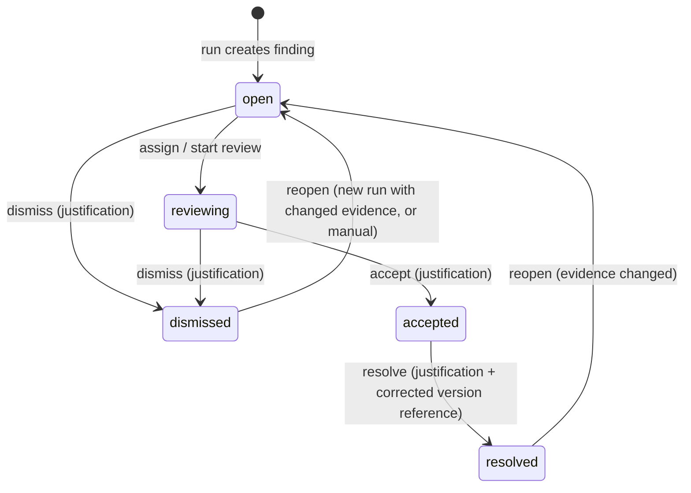
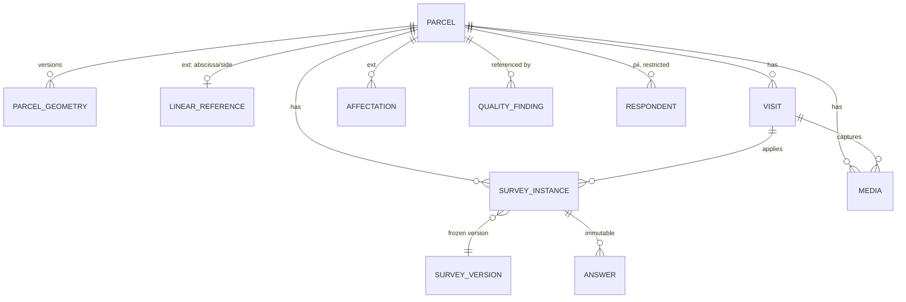

# Domain and data model (specification level)

> No migrations exist. Names are conceptual; table names will follow `snake_case` per module
> schema. Aligned with Gate 1 decisions D-013 (faceted provenance), D-015 (client access only via
> ClientPortalGrant), D-018 (privacy metadata) and D-019 (portal forecast). Every tenant-owned entity carries `tenant_id`; every project-scoped entity carries
> `(tenant_id, project_id)` with a composite FK to `project`. Every provenance-bearing entity
> carries `provenance_id` (ADR-005). Primary keys are UUID v7; business identifiers are separate
> unique columns per project.

## 1. Module map of the proposed decomposition (refined)

The brief's decomposition is kept, with additions marked **(+)** and moves marked **(→)**.

| Area | Entities |
|---|---|
| CORE | Tenant, User, TenantMembership, Role, Permission (+), Plan/Entitlement (+), Capability settings (+), Configuration (+) |
| PROJECTS | Project, ProjectMembership, ProjectProfile, ProjectUnit (+), Milestone (+), Deliverable, ActivityEvent (+), ForecastSnapshot (+), MetricSnapshot (+) |
| DOCUMENTS | SourceDocument, DocumentVersion, DocumentChunk (→ from "document intelligence"), DocumentLocator (+, value object) |
| GIS (core part) | SpatialDataset (+), SpatialDatasetVersion (+), Layer (+), Parcel, ParcelGeometry |
| GIS (linear_infrastructure extension) | Alignment/Road, Segment (= ProjectUnit kind), LinearReference (+), Affectation, AffectationItem (+) |
| FIELD | Assignment, Device (+), Visit, SurveyTemplate, SurveyVersion, Question, SurveyInstance, Answer, Media, Respondent/Household (+, in `pii` schema) |
| SOCIAL | Taxonomy, TaxonomyVersion, Category (+), CategoryProposal, ClassificationRun (+), AIClassification, HumanReview, AnswerCoding (+, derived), SocialMetric |
| QUALITY | Requirement, RequirementVersion (+), QualityRun (+), QualityFinding, FindingEvidence, SpecialistReview |
| REPORTS (later) | GeneratedReport, ReportVersion, GeneratedSection, Citation (+) |
| CLIENT PORTAL | PortalPublication (+), ClientPortalGrant (+) |
| PROVENANCE / TRACEABILITY | ProvenanceRecord (DataProvenance, faceted), ProvenanceInput (+ lineage), ImportRun, CalculationRun (+), AuditLog |
| AI | ModelDescriptor (+), PromptVersion (+), DeidentificationRun (+), AiVendor / ProcessorRegistry entry (+) |
| PRIVACY (D-018) | DataInventoryEntry (+), ProcessingPurpose (+), RetentionPolicy (+), ProcessorRegistryEntry (+), LegalBasisRecord / ConsentRecord (+), RiskAssessmentRecord (+), DataSubjectRequest (+, future) |

## 2. Aggregates and ownership boundaries

An aggregate is the unit of consistency: one transaction, one root, invariants enforced inside.
References across aggregates are by id only.

| Aggregate root | Contains | Owned by | Invariants inside |
|---|---|---|---|
| **Tenant** | memberships, capability settings, configuration, entitlements | core | last owner rule; allowed domains; MFA policy |
| **Project** | memberships, capability settings, configuration, profile snapshot, units, milestones, deliverables | projects | project override only restricts; lifecycle transitions |
| **Parcel** | geometry versions, linear reference (ext), attributes | gis | one current geometry; code unique per project; geometry provenance |
| **SpatialDatasetVersion** | layers, features | gis | immutable once imported; supersedes previous version; legend key derived from kind + provenance facets |
| **SurveyTemplate** | versions → questions | field | published version immutable |
| **SurveyInstance** | answers, links to visit/parcel/respondent | field | answers immutable after `submitted`; instance state machine |
| **Visit** | media refs, GPS, technician, result | field | belongs to a parcel and (optionally) an assignment |
| **Taxonomy** | versions → categories | social | published version immutable; proposals produce new versions |
| **AIClassification** | (leaf, immutable) | social | never updated; new run = new rows |
| **HumanReview** | (append-only) | social | references answer + optional classification + taxonomy version |
| **Requirement** | versions (rule definitions) | quality | language rules; applicability |
| **QualityFinding** | evidence items, specialist reviews | quality | state machine; justification mandatory on decisions |
| **SourceDocument** | versions → chunks | documents | version immutable; chunks derived from a version |
| **PortalPublication** | published projection (JSON validated by allowlist schema) | client-portal | contains no forbidden field by construction |
| **ProvenanceRecord** | inputs (lineage) | provenance | immutable once referenced |
| **ImportRun / CalculationRun / ClassificationRun / QualityRun** | progress, status, outputs summary | owning module | idempotent by id; regime and source type fixed at creation |

Dangerous couplings identified and how they are avoided:

| Coupling | Risk | Rule |
|---|---|---|
| Parcel ↔ road fields | core surveys assume abscissa | `Parcel` core has no linear fields; `LinearReference` is an extension row; field/social reference `parcel_id` only |
| Quality ↔ every table | FK sprawl, rules coupled to schemas | `FindingEvidence` holds a typed **locator** (kind + ids + position), validated per kind, not FKs to every table |
| Social analytics ↔ field tables | analytics reading raw answers or unvalidated codings | `social` consumes a `ValidatedAnswerView` read model published by `field` + its own `AnswerCoding` with status VALIDATED |
| Portal ↔ operational tables | leak by join | portal reads only `portal.*` projection rows written by `PortalPublication` |
| AI ↔ PII | identified text sent to providers | `ai` ports accept only `Deidentified<T>`; PII types live in `pii` schema and are not importable by `ai` |
| Reports ↔ live metrics | numbers drift after publication | reports store `MetricSnapshot` + `provenance_id` per figure |
| Forecast ↔ live counts | non-reproducible projection | `ForecastSnapshot` stores input snapshot, algorithm version, assumptions, timestamp |
| Parcel identity ↔ geometry source | replacing synthetic geometry rebuilds parcels | geometry is versioned (`ParcelGeometry` rows linked to `SpatialDatasetVersion`); parcel id is stable |
| Survey answers ↔ template changes | reinterpretation of history | `Answer` references `SurveyVersion` + `Question` (versioned); templates never mutate published versions |

## 3. Entity specifications

### 3.1 Core and projects

```
Project { id, tenant_id, slug, name, profile_key, profile_version, lifecycle: planning|field|analysis|review|delivered|closed,
          demo_mode: bool, target_date, owner_membership_id, crs (config), created_at }
ProjectUnit { id, tenant_id, project_id, kind: 'road_segment'|'sector'|'zone'|'site', code, name, order, geometry?, attributes jsonb, provenance_id }
Milestone { id, ..., key, label, state: planned|in_progress|completed, note, planned_at, completed_at, visible_in_portal: bool }
Deliverable { id, ..., name, note, due_at, state: planned|draft|review|approved|delivered, approved_by, document_version_id?, visible_in_portal }
ActivityEvent { id, ..., occurred_at, actor (membership or system), action_key, object_ref (typed), summary, provenance_id }
MetricSnapshot { id, ..., metric_key (enum), numeric_value | date_value, note, display_order, observed_at, provenance_id }
ForecastSnapshot { id, ..., algorithm_version, as_of_date, pending, daily_completions[], window_days, moving_average_per_day,
                   required_rate_per_day, active_technicians, assigned_technicians, target_date, projected_close_date, delay_days,
                   assumptions[], calculated_at, provenance_id }
```

#### Where a demo simulation's clock lives (IG1-009)

A demo dataset needs a fixed as-of date, or its figures drift with the machine's calendar and a
reviewer sees different numbers each session. That date is **not** a property of `Project`.

`Project` is a real consulting engagement. Putting `demo_scenario_date` on it would have leaked a
demonstration concern into the canonical entity every module builds on, and every future project —
including real ones — would have carried a column that means nothing to them.

The date belongs to the calculation it anchors, so it is `ForecastSnapshot.as_of_date`: the
`calculatedFrom` input, persisted so the result can be recomputed from the row alone. For a
`DEMO_SIMULATION` forecast that anchor *is* the scenario clock, and the regime on its provenance
record already says which kind it is. `demoScenarioDate(forecast, provenance)` is the whole rule.

The other demo instants are persisted on the rows that own them — `activity_event.occurred_at`,
the `captured_at` of the demo provenance records — derived at seed time from the fixture's
`demoScenario.scenarioDate`, which stays fixture metadata and reaches no table.

There is no `Scenario` entity, no scenario table and no scenario subsystem: one field, on the row
that already needed it. Historical observed values are untouched and keep their own capture dates
on their own provenance records; the two clocks live in different places precisely so they cannot
merge by accident.

#### MetricSnapshot is a curated projection, not the analytics store (IG1-002)

This is the scope boundary of the entity, and it is an invariant rather than a preference.

`MetricSnapshot` exists for one purpose: the handful of figures a coordinator reads at a glance
on the Command Center and the Portfolio card. It is a **read model** shaped for that surface —
one shape, one provenance link, one ordering — assembled from values that originate in several
modules.

It is **not** where measurements live. Every module keeps its own canonical model and remains
the source of truth for its data:

| Module | Canonical models |
|---|---|
| `gis` | Parcel, ParcelGeometry, Affectation, SpatialDatasetVersion |
| `field` | Assignment, Visit, SurveyInstance, Answer, Media |
| `social` | AnswerCoding, TaxonomyVersion, SocialMetric and its analytics read models |
| `quality` | QualityRun, QualityFinding, SpecialistReview |
| `documents`, `reports` | SourceDocument, DocumentVersion, GeneratedReport |

A module **projects** a selected output into a `MetricSnapshot` when the Command Center needs to
show it; it never stores its measurements here, and analytics never reads from here. Reports and
the portal snapshot the figures they publish, with the provenance id, exactly as before.

Three mechanisms keep the boundary from eroding:

1. `metric_key` is a PostgreSQL **enum**, so a caller cannot invent a key at runtime;
2. `packages/domain/test/metrics.test.ts` pins the exact curated set and asserts that
   module-owned measurements (parcel area, visit duration, coding score, open findings…) are
   *not* valid keys, so an addition has to be deliberate and reviewed;
3. the vocabulary is declared once, in `packages/domain/src/projects/metrics.ts`, with the rule
   written above it.

The question to ask before adding a key is "does a coordinator need this in the ten-second
glance?" — not "where can I put this number?".


### 3.2 Documents

```
SourceDocument { id, tenant_id, project_id, code ('DOC-118'), title, kind: report|annex|minutes|plan|legal|other, contains_pii: bool, current_version_id }
DocumentVersion { id, document_id, version_label ('v3'), storage_key, mime, sha256, page_count, imported_by, imported_at, import_run_id, provenance_id, immutable }
DocumentChunk { id, document_version_id, ordinal, page_from, page_to, section_path, text (redacted when contains_pii), token_count, embedding (vec schema, later) }
DocumentLocator (value) { document_version_id, page?, section?, chunk_id?, bbox?, quote? }
```

### 3.3 GIS

**Implemented in Slice 2** (migrations `0009`, `0010`, and the Gate 2 hardening `0011`). The
shapes below are what the tables actually hold; where they differ from the earlier specification,
the difference is noted.

```
SpatialDataset { id, tenant_id, project_id, kind: alignment|parcels|affectations, label }
   -- unique (tenant_id, project_id, kind): one dataset of a kind per project
SpatialDatasetVersion { id, tenant_id, project_id, dataset_id, version_label ('parcels_v1'),
    origin: generated|imported|field_captured,
    source_srid, analysis_srid, generator_version?,
    feature_count, is_active, supersedes_version_id?, produced_at, note?, provenance_id }
   -- exactly one active version per dataset (unique partial index)
   -- `origin` records the production route; it is NOT a provenance vocabulary (ADR-005)
   -- legend key (REAL_BASE_MAP | RECONSTRUCTED_ALIGNMENT | SYNTHETIC_PARCELS |
      OFFICIAL_IMPORTED_ALIGNMENT | OFFICIAL_CADASTRE | FIELD_CAPTURED)
      is derived from dataset.kind + the facets of provenance_id (PROVENANCE.md §2.7), not stored
Parcel { id, tenant_id, project_id, parcel_code (unique per project), sector_label?,
    side: left|right|both, status: confirmed|estimated|not_located|excluded,
    chainage_m?, chainage_method?, frontage_m?, provenance_id }
   -- CHECK parcel_code_shape: uppercase alphanumeric groups separated by hyphens
   -- CHECK: chainage_m and chainage_method are both present or both absent
   -- CHECK: chainage_m >= 0; frontage_m > 0 when present
ParcelGeometry { id, tenant_id, project_id, parcel_id, dataset_version_id,
    geom geometry(Polygon,4326), area_m2, is_active, superseded_by_geometry_id?, provenance_id }
   -- exactly one active geometry per parcel (unique partial index)
   -- CHECK: ST_IsValid(geom) AND NOT ST_IsEmpty(geom); area_m2 > 0
-- linear_infrastructure extension
Alignment { id, tenant_id, project_id, dataset_version_id, label,
    geom geometry(LineString,4326), length_m, station_origin_m, provenance_id }
   -- CHECK: length_m > 0
Affectation { id, tenant_id, project_id, parcel_id, dataset_version_id,
    category: right_of_way|access|infrastructure|crops|other,
    geom geometry(Polygon,4326), affected_area_m2, provenance_id }
   -- CHECK: affected_area_m2 >= 0  (zero is a legitimate observation: "not affected")
   -- CONSTRAINT TRIGGER affectation_within_parcel: affected_area_m2 <= the parcel's active area
```

#### Coordinate reference systems (ADR-017)

Three roles, kept apart. Only the first is a property of the platform.

| Role | Where it lives | Value |
|---|---|---|
| **Canonical** — what every geometry column stores | the schema | always `EPSG:4326` |
| **Source** — what a dataset version arrived in | `spatial_dataset_version.source_srid` | per dataset |
| **Analysis** — where metres are computed | `spatial_dataset_version.analysis_srid` | per dataset |

Canonical storage is `EPSG:4326` because it is the one CRS every project can share and the one
MapLibre consumes, so **reads need no transform**. Typing the columns as a projected zone, as
migration 0009 did, would make one pilot's UTM zone a property of the product and make a project
outside it unstorable.

Metres never come from degrees. Every length and area is computed by transforming canonical
geometry into the dataset's analysis CRS:

```sql
ST_Area(ST_Transform(geom, analysis_srid))
```

**An SRID numeric value is never used to infer CRS type.** `analysis_srid` must be projected and
metre-based, and that is decided from the CRS **definition** in `spatial_ref_sys`, not from the
number: `EPSG:4087` is projected and metric inside the 4xxx block, `EPSG:6318` is geographic
outside it, so any numeric rule gets both wrong (ADR-017 §"How a CRS is judged").

Four conditions, checked by `app.srid_is_metric_projected` and by
`assertAnalysisSridUsable` in the application layer: registered in `spatial_ref_sys` (any
authority, including a custom SRS); `PROJCS`/`PROJCRS`; a linear unit of metre with factor 1; and
`ST_Transform` able to build a transform for it. `source_srid` need only be registered — a package
delivered in a geographic CRS is normal.

The supported analysis-CRS contract is **projected + metre-based**, because the stored columns are
metres and square metres. A projected CRS in feet is refused rather than silently reinterpreted;
non-metric support is future work, and only if a real project needs it.

**Which CRS owns which measurement**: the alignment's `analysis_srid` measures the corridor's
length and every chainage along it; a parcel's own dataset measures its area; an affectation's own
dataset measures its affected area. In the pilot all three coincide; after an official import they
may not, and a road must not be measured with a parcel layer's ruler.

The pilot's `analysis_srid` is `32717` (UTM 17S) and is a **demo assumption** recorded in the
project fixture with `crsBasis: "DEMO_ASSUMPTION"`: the official GIS package has not been
received, so the project's declared CRS is unknown. It appears nowhere in `packages/domain`.

#### Chainage (IG2-003)

Chainage is the *abscisa* of the approved design, rendered `2+840`. It is **derived from the
geometry that is stored**, by one deterministic method, recorded on every value:

```
parcel centroid
  → ST_LineLocatePoint onto the project's active alignment   (fraction along the line, 0–1)
  → × the alignment's length measured in the analysis CRS
  → chainage in metres                                        (chainage_method = centroid_projection)
```

It is `centroid_projection` and not `frontage_midpoint` because a frontage midpoint would claim we
know where each parcel meets the road; for synthetic polygons we do not, and the centroid is a
property of the geometry we actually have. When surveyed frontage exists, the method changes and
the column says so.

Two consequences hold by construction and are asserted by tests: chainage lies in
`[0, alignment length]`, and it is **not identity** — recreating a parcel under a new UUID with the
same geometry produces the same chainage, and two parcels may share one.

#### Dataset activation and replacement (IG2-002)

`activateDatasetVersion` (in `packages/application/src/gis/`) is the transaction an official
import will end with. It deactivates the current version and its geometry, activates the new
version and its geometry, and does all of it in one transaction:

```
SpatialDataset (kind = 'parcels')
  └── parcels_v1   origin=generated  is_active=false  ← superseded, retained
  └── parcels_v2   origin=imported   is_active=true   supersedes=parcels_v1
```

- `Parcel.id` is never reissued: the table is not touched. New `ParcelGeometry` rows are written
  against the new version; the parcel's UUID, its code and everything pointing at it are unchanged.
- Active-version uniqueness is scoped to the **dataset**, so `alignment` and `parcels` have active
  versions simultaneously; activating one never disturbs the other.
- A replacement must name the version it supersedes, or the domain rule rejects it and the
  transaction rolls back with the previous version still active.
- Nothing is deleted, so a figure produced from superseded geometry stays explainable.

#### The affected share is derived, never stored

`affected_area_m2 / area_m2`, computed wherever it is shown. A persisted percentage is a third
fact beside two areas and is wrong the moment geometry is replaced, while still looking right.
The domain helper throws on every case the database already forbids rather than clamping, because
a clamped `1,0` is indistinguishable from a genuine total affectation.

#### What changed from the earlier specification, and why

| Earlier shape | What was built | Why |
|---|---|---|
| `geometry(...,4326)` with metric work in "the project's configured CRS" | canonical `geometry(...,4326)` + `analysis_srid` per dataset version | the intent was right; it needed a place to live that is not a column type (ADR-017) |
| `SpatialDatasetVersion.source_crs` (text) | `source_srid` + `analysis_srid` (integers) | a text label cannot be passed to `ST_Transform`, and could not say where metres come from |
| `SpatialDataset.current_version_id` | `SpatialDatasetVersion.is_active` + unique partial index | the pointer and the flag can disagree; one enforced flag cannot |
| `Layer` table | not created | a layer is currently a dataset version rendered by the client; a table with no distinct behaviour would be dead weight until styles are configurable |
| `Parcel.current_geometry_id` | `ParcelGeometry.is_active` | same reason as the dataset pointer |
| `Parcel.attributes jsonb` | not created | no profile declares attributes yet; an unvalidated bag would fill with ad-hoc columns |
| `LinearReference` as a separate row | `chainage_m` / `chainage_method` / `side` on `Parcel` | one nullable reference per parcel is a column, not a table; promoting it later is a mechanical migration, and the CHECK already prevents a chainage without its method |
| `Affectation.pct`, `.state`, `AffectationItem` | area only; ratio derived | a stored percentage drifts from the geometries it came from; the review workflow and the itemisation carry legal and personal-data weight this slice does not own |
| `Parcel.unit_id` | not created | `ProjectUnit` does not exist yet; `sector_label` is free text until it does |

The parcel **operational state** shown on the map (Completo · Visitado · Pendiente · Requiere
revisita · Inconsistencia · No localizado) is a **derived read model**, computed from instrument
states, visits, open findings and `Parcel.status`, not a stored column that can drift. Slice 2
renders only `Parcel.status`, because nothing in it can know whether a parcel was visited;
`DESIGN_SURVEY_STATES_PENDING_FIELD` records the target vocabulary so the reduction stays visible.

#### Measured payload and query cost (IG2-008)

The pilot, 141 parcels, measured locally against PostgreSQL 17 + PostGIS 3.5:

| Measure | Value |
|---|---|
| `loadParcelExplorer` server time | median 6,4 ms · p95 7,6 ms (12 runs) |
| `loadTerritorialSummary` server time | median 3,7 ms · p95 4,1 ms |
| Parcel features | 141 |
| GeoJSON `FeatureCollection` | 46,7 KiB |
| Alignment geometry | 4,2 KiB |
| Table rows payload | 64,9 KiB |
| Whole read-model payload | 117,2 KiB |
| Browser: table visible / canvas sized | ~535 ms / ~800 ms after navigation |

GeoJSON is adequate here by a wide margin. The trigger for reconsidering vector tiles or
virtualization is observational, not architectural: a project whose parcel payload approaches the
server-side cap of 2 000 features (roughly 650 KiB of GeoJSON at this density), or a measured
interaction delay in the table. See TECH_DEBT TD-027.

#### 3.3a What the real package changed (ADR-023)

The cartographic package arrived on 2 September 2026 and contradicted three assumptions this
section made while the corridor was still generated. All three are properties of real cadastral and
environmental data, so the model moved rather than the data.

```
Alignment.geom        geometry(LineString,4326)  →  geometry(MultiLineString,4326)
ParcelGeometry.geom   geometry(Polygon,4326)     →  geometry(MultiPolygon,4326)
Affectation.geom      geometry(Polygon,4326)     →  geometry(MultiPolygon,4326)

Parcel { …, chainage_m, chainage_start_m, chainage_end_m, chainage_method }
InfluenceArea { id, tenant_id, project_id, dataset_version_id,
                kind: direct | indirect | direct_social | indirect_social,
                label, geom geometry(MultiPolygon,4326), area_m2, provenance_id }
   -- unique (tenant_id, dataset_version_id, kind): a redelimitation is a new version
```

**Multi-part is the normal case, not an edge case.** 20 of the 141 delivered parcels are two
polygons — a plot split by the road, or with a detached portion — and one affectation is eight. A
polygon is a valid multipolygon of one part, so the widening is lossless and migration 0024 applies
it with `ST_Multi`.

**A parcel's chainage is a range.** The package states an `INICIAL` and a `FINAL` abscissa per
parcel with the side; `chainage_m` keeps its meaning as the single point the corridor orders by and
takes the start. `chainage_method` distinguishes the 139 the consultancy declared from the 2 this
product derived from geometry, so the two are never confused on a screen.

**Influence areas are a layer.** AID, AII, AISD and AISI are what an environmental study delimits
and what the PGAS's *lugar de aplicación* points at. One table, project-scoped, versioned by
`spatial_dataset_version` exactly as parcels are — not a parcel with a category, because an
influence area has no code, no owner and no field sheet.

### 3.4 Field

```
SurveyTemplate { id, tenant_id, project_id?, key ('socioeconomic_sheet'), name, current_version_id }
SurveyVersion { id, template_id, version_label ('v2'), status: draft|published|retired, published_at, schema_hash, requirements jsonb (min_photos: 4, require_gps), provenance_id }
Question { id, survey_version_id, key ('P17'), ordinal, kind: single|multiple|numeric|scale|open|photo|gps|signature, label, options jsonb, pii: bool, required }
Assignment { id, ..., technician_membership_id, parcel_ids[] or unit_id, planned_date, state }
Device { id, tenant_id, device_key, technician_membership_id, offline_enabled, last_sync_at }
Visit { id, ..., parcel_id, assignment_id?, technician_membership_id, device_id?, started_at, ended_at, duration, gps point, gps_accuracy_m,
        result: complete|revisit|not_found|refused, field_note, provenance_id }
SurveyInstance { id, ..., survey_version_id (immutable), parcel_id, visit_id?, respondent_id? (pii), state: not_started|in_progress|complete|needs_review|validated,
                 completeness_pct, submitted_at, validated_by, validated_at, capture_device_id?, provenance_id }
Answer { id, instance_id, question_id, value jsonb, value_text (open), captured_at, immutable_after_submit }
Media { id, ..., parcel_id, visit_id?, instance_id?, kind: photo|sketch|document|audio, storage_key, captured_at, gps?, gps_status: ok|missing|pending_sync, sha256, provenance_id }
pii.Respondent { id, tenant_id, project_id, parcel_id?, pseudonym ('HH-0412'), name, phone, id_number, consent_ref, retention_until }
```

Survey versioning invariant: a `SurveyInstance` references exactly one `SurveyVersion`; `Answer`
references a `Question` of that version. Publishing v2 never touches v1 instances. Aggregations
across versions require an explicit `QuestionMapping (from_question_id → to_question_id, method)`
recorded with provenance (ADR-006).

Instrument state semantics (spec §06): only `validated` feeds analytics and reports; `complete`
means filled, not reviewed.

#### 3.4a As built in Slice 3

The specification above is the target shape for the whole Field module. Slice 3 implemented the
part FieldFlow needs, with these differences — each a deliberate narrowing, not a drift:

```
ProjectConfiguration { tenant_id, project_id, key, value jsonb, version }        -- offline_mode lives here (ADR-018)
SurveyTemplate  { id, tenant_id, project_id, key, name, description }
SurveyVersion   { id, ..., template_id, version_label, status DRAFT|PUBLISHED|RETIRED,
                  published_at, definition_hash, provenance_id }
SurveyQuestion  { id, ..., version_id, code, ordinal, type, prompt, help_text, required, sensitivity }
SurveyOption    { id, ..., question_id, code, label, ordinal }
SurveyCampaign  { id, ..., name, survey_version_id, status DRAFT|ACTIVE|CLOSED,
                  capture_channel, offline_mode_at_activation, activated_at, closed_at, provenance_id }
FieldAssignment { id, ..., campaign_id, parcel_id, assignee_membership_id, assignee_user_id,
                  status PENDING|IN_PROGRESS|COMPLETED|CANCELLED, assigned_at, completed_at, provenance_id }
FieldVisit      { id, ..., assignment_id, technician_user_id, status IN_PROGRESS|COMPLETED,
                  started_at, completed_at, location geometry(Point,4326), location_accuracy_m,
                  location_captured_at, location_outcome, provenance_id }
SurveyInstance  { id, ..., assignment_id, visit_id, survey_version_id, respondent_user_id,
                  status IN_PROGRESS|SUBMITTED, started_at, submitted_at, provenance_id }
SurveyAnswer    { id, ..., instance_id, question_id, text_value | number_value | boolean_value |
                  date_value | option_id }                       -- exactly one, enforced
SurveyAnswerOption { id, ..., answer_id, option_id }              -- multi-choice selections
```

| Difference from §3.4 | Why |
|---|---|
| `SurveyCampaign` is new; `Assignment` hangs off it and targets one `parcel_id` | A campaign is what a coordinator opens, closes and measures. An assignment with an array of parcels has no state of its own and no progress to count. |
| Answers use **typed columns**, not `value jsonb` | A blob cannot be constrained, cannot be indexed usefully, and lets a v2 option code stand where a v1 option belongs. The exclusivity, the type match and the option's membership of the same version are constraint triggers (migration 0014). |
| `question.sensitivity` (NON_PERSONAL / PERSONAL / SENSITIVE) replaces `pii: bool` | Three values the retention and export policies can act on; still a classification, never an authorization. |
| `assignee_user_id` and `technician_user_id` are denormalised beside the membership id | So the RLS policies compare two columns instead of joining `project_membership` from inside a policy that would itself be evaluated against a policied table. |
| `Device`, `Media`, `pii.Respondent`, `QuestionMapping` are not implemented | No offline channel (ADR-018), no media capture and no identified respondents in this slice. Their absence is the honest state, not an omission to backfill quietly. |
| Question types are the eight in `QUESTION_TYPES` | No matrices, repeating groups, signatures, skip-logic expressions or calculation language: each is a small language, and none is needed by the demo questionnaire. |

Immutability, enforced by database triggers rather than by application code alone:

- a `PUBLISHED` or `RETIRED` `SurveyVersion` cannot be edited or deleted; its questions and
  options cannot be added to, edited or removed. Editing means publishing a new version.
- a `SurveyInstance` may only be created against a `PUBLISHED` version, and once `SUBMITTED`
  nothing about it moves — including its `survey_version_id`.
- answers of a submitted response cannot be inserted, updated or deleted.

Correction of a submitted response is deliberately **not** implemented. When it exists it will be
a reviewed workflow that records who changed what and why, not a row edit.

### 3.5 Social intelligence

```
Taxonomy { id, tenant_id, project_id, key ('social_expectations'), current_version_id }
TaxonomyVersion { id, taxonomy_id, version_label ('v4'), status: draft|published|retired, published_by, published_at, immutable }
Category { id, taxonomy_version_id, key, parent_id?, label, definition, example, ordinal }
CategoryProposal { id, ..., taxonomy_version_id (base), proposed_label, proposed_definition, rationale, sample_answer_ids[], origin: ai|human,
                   model_ref?, state: proposed|reviewing|approved|modified|rejected, decided_by, decided_at, resulting_version_id? }
ClassificationRun { id, ..., taxonomy_version_id, model_descriptor_id, prompt_version_id, deidentification_run_id, scope (question/filter), started_at, finished_at, status }
AIClassification { id, ..., answer_id, run_id, taxonomy_version_id, suggested_category_id?, suggested_subcategory_id?, candidates jsonb [{category_id, score}],
                   model_score numeric(4,3), confidence_label: high|medium|low, thresholds_snapshot jsonb, rationale text, provider, model, model_version, prompt_version,
                   created_at, immutable }
HumanReview { id, ..., answer_id, classification_id?, action: accept|modify|new_category|reject|second_opinion|manual,
              validated_category_id?, validated_subcategory_id?, taxonomy_version_id, reviewer_membership_id, reviewed_at, note, immutable }
AnswerCoding (derived, materialised) { answer_id, status: unreviewed|low_confidence|disagreement|validated|rejected,
              validated_category_id?, taxonomy_version_id?, last_review_id?, ai_classification_id? }
SocialMetric { id, ..., metric_key ('P17.frequency'), segment jsonb, taxonomy_version_id?, value jsonb, n_base, as_of, provenance_id }   // facets incl. regime live on the provenance record
```

Three layers, three tables: `Answer` (immutable source), `AIClassification` (immutable
suggestion), `HumanReview` (append-only decision). The "current validated category" is a derived
projection (`AnswerCoding`) recomputed from reviews; analytics read only rows with status
`validated`, and every `SocialMetric` records which taxonomy version it was computed against.
"Disagreement" = two reviews with different validated categories and no final decision.

### 3.6 Quality gate

> **Amended by ADR-020 (Slice 5).** `Requirement` and `RequirementVersion` are **not tables**. The
> rule catalogue is versioned code (`packages/domain/src/quality/requirements.ts`) and a finding
> stores `requirement_key` + `requirement_version` as text. A `definition jsonb` beside a
> TypeScript implementation would give one rule two homes that nothing keeps in agreement; making
> the jsonb authoritative means writing an interpreter for it, which is the generic rule engine the
> slice deliberately does not build.

```
DocumentAssertion { id, ..., key ('parcels.affected_count'), source_kind: RECONSTRUCTED_CORPUS|DOCUMENT_VERSION,
                    source_ref ('Anexo de afectaciones prediales'), exactly one of
                    value_text | value_number | value_date | value_boolean, quote?, qualifier?, provenance_id }
QualityRun { id, ..., trigger: MANUAL|SCHEDULED|EVENT, requirements text[] ('rule.x@1'), status,
             started_at, finished_at, findings_created, findings_updated, findings_reopened,
             initiated_by_user_id, provenance_id }
QualityFinding { id, ..., finding_code ('QG-014'), fingerprint (dedupe across runs, unique per project),
                 first_run_id, last_run_id, requirement_key, requirement_version, type, severity: high|medium|low,
                 state: OPEN|UNDER_REVIEW|ACCEPTED|DISMISSED|RESOLVED, title, explanation, why_flagged,
                 suggested_action, interdisciplinary_review_required, parcel_id?, detected_at, last_seen_at,
                 updated_at, provenance_id }
FindingEvidence { id, ..., finding_id, role: SOURCE_A|SOURCE_B|CONTEXT, locator jsonb (typed union),
                  label, quote, ordinal }
SpecialistReview { id, ..., finding_id, decision, from_state, to_state, justification (>= 12 chars),
                   reviewer_user_id, reviewed_at }   // append-only: no UPDATE grant, no DELETE grant, triggers too
```

Evidence locator kinds (Slice 5): `assertion {assertion_id, source_ref}`, `project {field}`, and
`document_version {document_version_id, page?, chunk_id?}` — the last declared for Slice 6 so a
finding raised now can be *enriched* with a real citation later rather than rewritten. Nothing
produces a `document_version` locator yet, and a CHECK refuses a `DOCUMENT_VERSION` assertion while
no document has been ingested: a page number nobody can verify is a fabricated citation in the one
field whose purpose is verification.

`DocumentAssertion` is the evidence substrate until document ingestion exists. One extracted value
from the study corpus, with the human-readable reference it was read from and its own provenance
(`HISTORICAL_OBSERVED` / `IMPORTED_DOCUMENT` / `RECONSTRUCTED`). Exactly one of the four value
columns is populated, enforced by a CHECK — a rule comparing dates must compare dates, and a row
carrying both a number and a date lets a rule silently read the wrong one.

Invariants enforced in the database (migration 0019), not only in the use-case:

| Guarantee | Mechanism |
|---|---|
| A decision is never edited or deleted | `REVOKE UPDATE, DELETE` from `eia_app` (required: migration 0002's `ALTER DEFAULT PRIVILEGES` grants full DML on every new `app` table) **and** BEFORE UPDATE/DELETE triggers, so the owning role cannot either |
| A justification is not a token word | CHECK `length(btrim(justification)) >= 12` |
| A finding compares exactly two sources | deferred CONSTRAINT TRIGGER on both `quality_finding` and `finding_evidence`, checked at commit |
| An assertion holds exactly one value | CHECK over the four value columns |
| A date is a calendar date | CHECK on the `yyyy-mm-dd` shape |
| A finding is raised once per disagreement | `fingerprint` unique per project; a re-run updates, and only *changed evidence* reopens a decided finding |

State machine (ADR-008):



### 3.6a Report generation (Slice 7, ADR-022)

```
GeneratedReport { id, tenant_id, project_id, kind: social_chapter, title, current_version_id }
   -- unique (tenant_id, project_id, kind): a chapter is a thing a study has; its history is its versions
ReportVersion { id, ..., report_id, version_label ('v3'), status: DRAFT,
                snapshot jsonb (validated by ReportSnapshotSchema — the deterministic substance),
                snapshot_digest (content identity, excluding the instant it was computed),
                survey_version_label, narrative_model?, narrative_prompt_version?,
                generated_by_user_id, generated_at, provenance_id }   -- immutable
ReportSection { id, ..., version_id, key, title, ordinal, summary, narrative? }   -- immutable
ReportSectionSource { id, ..., section_id, kind, fact_key, locator jsonb, ordinal }   -- immutable
```

**The snapshot is the deliverable** (ADR-022). Every figure it holds is computed from validated data
and carries a typed source — `metric` (with its method in words), `human_review` (a validated
coding, never a proposal), `quality_finding`, `document_chunk`, or `provenance` (with its facets).
A fact with no source is unrepresentable: the type has no shape for one. Prose is optional and is a
rendering of the snapshot, so a version with no narrative is a complete report draft.

Invariants enforced in the database (migration 0023):

| Guarantee | Mechanism |
|---|---|
| A version, its sections and their sources are written once | `REVOKE UPDATE, DELETE` from `eia_app` **and** BEFORE UPDATE/DELETE triggers, so the owning role cannot either; the cascade from the report is the one legitimate deletion |
| A project has one chapter of each kind | unique `(tenant_id, project_id, kind)` |
| A version's label is unique within its report | unique `(tenant_id, report_id, version_label)` |
| A version carries provenance | FK to `provenance_record`, written `DERIVED` / `PENDING` — a chapter never records itself as validated |

### 3.7 Client portal

```
PortalPublication { id, tenant_id, project_id, version, published_by, published_at, projection jsonb (validated by PortalProjectionSchema), regime_summary,
                    published_forecast_snapshot_id? (only when client.portal.show_forecast is on; never DEMO_SIMULATION), provenance_id, state: draft|published|withdrawn }
ClientPortalGrant { id, tenant_id, project_id, user_id, state: invited|active|revoked, granted_by, expires_at }   // the ONLY representation of client access (D-015)
```

`PortalProjectionSchema` (zod, `strict()`) is an **allowlist**: overall progress, phase summary,
aggregate figures (with provenance facets), milestones flagged `visible_in_portal`, sector
progress (units, without parcel identifiers), deliverables flagged visible, published activities,
last update, legal note, and optionally one explicitly published forecast snapshot with its
provenance id, calculation time, algorithm version, assumptions and projection wording (D-019).
Anything else is unrepresentable (ADR-009).

### 3.8 Provenance and traceability

```
ProvenanceRecord { id, tenant_id, project_id?,
                   -- facets (Gate 1 D-013); the v0.2 SOURCE TYPE badges are derived in the UI, never stored
                   regime: HISTORICAL_OBSERVED|LIVE_OPERATIONAL|DEMO_SIMULATION,
                   origin: FIELD_CAPTURE|IMPORTED_DOCUMENT|IMPORTED_DATASET|SYSTEM_GENERATED (extensible),
                   transformations: ordered list of ORIGINAL|RECONSTRUCTED|DERIVED|ANONYMIZED,
                   granularity: INDIVIDUAL|AGGREGATE|null,
                   source_ref (document_version_id | dataset_version_id | import_run_id | capture ref),
                   version_label, captured_at, capture_medium: fieldflow|import|manual|calculation|ai, method_text (one-line formula/criterion, derived only),
                   calculation_run_id?, deidentification_run_id?, validation_status: validated|partial|pending|requires_specialist|not_required|not_validated,
                   validated_by?, validated_at?, note, created_at, immutable }
ProvenanceInput { provenance_id, input_provenance_id, role }   // lineage edges; transformations accumulate along the chain
ImportRun { id, tenant_id, project_id, kind: documents|gis|surveys|fixtures|taxonomy, source_descriptor jsonb, regime, default_origin, default_transformations, started_by, started_at, finished_at, status, stats jsonb, error_ref }
CalculationRun { id, ..., calculator_key, calculator_version, inputs_snapshot jsonb, assumptions jsonb, computed_at, provenance_id }
AuditLog (audit schema, append-only) { id, tenant_id, project_id?, actor_user_id?, actor_kind: user|system|job, action_key, object_kind, object_id, reason?, request_id, ip_hash, occurred_at, details jsonb (no PII values) }
```

### 3.9 Privacy-by-design metadata (Gate 1 D-018)

These entities let the product describe its own personal-data processing; they carry no legal
conclusions and are inputs to the compliance review that gates production ingestion of real PII.

```
DataInventoryEntry { id, tenant_id, dataset_key (e.g. 'survey.socioeconomic_sheet.v2', 'pii.respondent'), data_categories[] (identifiers, contact, economic, health, vulnerability, location, image),
                     data_subjects[] (respondent, household member, technician, client user), storage_location (schema/bucket prefix), pii: bool, owner_role, created_at }
ProcessingPurpose { id, tenant_id, key, description, inventory_entries[], legal_basis_kind? (free text/enumeration maintained by the tenant's compliance owner), active }
RetentionPolicy { id, tenant_id, inventory_entry_id, trigger: project_close|capture|delivery, months, action: anonymize|delete|archive, last_run_id? }
ProcessorRegistryEntry { id, tenant_id?, vendor_name, service (llm|embedding|storage|email|maps|analytics), region, data_categories_allowed[], contract_ref, status, ai_vendor: bool, model_families[] }
LegalBasisRecord / ConsentRecord { id, tenant_id, project_id, respondent_id (pii), basis_kind, reference (signed sheet, minute), captured_at, captured_by, withdrawn_at? }
RiskAssessmentRecord { id, tenant_id, project_id?, kind: dpia|risk_assessment, status, reference_document_version_id?, reviewed_at, reviewer }
DataSubjectRequest (future) { id, tenant_id, kind: access|rectification|erasure|objection, subject_ref, received_at, due_at, state, handled_by }
```

## 4. Historical vs live vs simulation

`regime` lives on `ProvenanceRecord` and is set by the producing run:

| Regime | Produced by | May appear in | Rendering |
|---|---|---|---|
| `HISTORICAL_OBSERVED` | imports of the real expedient, validated field captures of a real project | everything, deliverables, portal | no block badge; derived provenance label in drawer |
| `LIVE_OPERATIONAL` | field sync, quality runs, classifications on a live project | workspace, portal (aggregated, explicitly published), deliverables when validated | no block badge |
| `DEMO_SIMULATION` | fixture imports flagged demo, synthetic generators | workspace with badge; **never** deliverables; never published to the portal as client progress (D-019) | `DEMO / SYNTHETIC` badge derived from the block's provenance |

Regime is one of the four provenance facets (regime, origin, transformations, granularity;
PROVENANCE.md §2). Read models expose `{ value, provenance facets, provenanceId }` and the UI
figure component requires them; a block shows the DEMO badge when any composing value has regime
`DEMO_SIMULATION`. Exports refuse `DEMO_SIMULATION` values unless the export is explicitly a demo
export (watermarked). See PROVENANCE.md.

## 5. Parcel as territorial workspace



Identity rules: `id` (UUID) is the technical identity; `parcel_code` is the business identifier
(unique per project, pattern from configuration); owner name, coordinates and abscissa are never
identifiers. The Parcel Workspace tabs map to: Resumen (derived state + alerts + activity),
Visitas (`Visit`), Instrumentos (`SurveyInstance`), Afectaciones (extension), Media (`Media`),
Quality (`QualityFinding` where `parcel_id` matches or evidence locator references the parcel).

## 6. Open modelling questions for Gate 1

1. Should `Respondent`/household PII be one entity per parcel or per survey instance (a parcel
   can have several households)? Proposed: per respondent, linked to parcel, referenced by
   instance.
2. Do tenants need their own `Requirement` rules (custom quality rules) in v1, or only system
   rules with per-project parameters? Proposed: system rules + parameters; custom rules later.
3. Is `ProjectUnit` geometry required for portal "sectors" progress? Proposed: optional.
4. Should `AnswerCoding` be a materialised table or a view? Proposed: table maintained in the same
   transaction as `HumanReview`, for indexable queue filters.


## 3.5b Social Intelligence tables (Slice 4)

Eight tables, in three groups that must never be collapsed into one another (ADR-019).

**The coding scheme.** `taxonomy` is the scheme as a concept; `taxonomy_version` is an immutable
definition with a status (`DRAFT` → `PUBLISHED` → `RETIRED`), a `definition_hash` and a
`source_note`; `taxonomy_category` belongs to exactly one version and is never shared between
versions, even at the same code. That last point is what stops a refinement from re-pointing a
historic coding at a redefined category. Project-scoped, like `survey_template` — a tenant-level
library of schemes is future work (TD-042).

**The proposal.** `classification_run` fixes one evaluation: taxonomy version, source survey
version and question, requested model, resolved model, provider, classifier kind, prompt version,
prompt hash, initiator, status and timings. `ai_classification` is one proposal for one answer
inside one run — status, confidence heuristic, `needs_review`, model id, provider, token counts,
latency, attempts, claim timestamp — with its labels in `ai_classification_category`. Unique on
`(tenant, run, answer)`, which is what makes a duplicate success impossible.

**The decision.** `human_review` records the reviewer, the classification reviewed, the exact
taxonomy version, the derived `ACCEPTED`/`CORRECTED` decision and the elapsed review time;
`human_review_category` holds the validated labels. Unique on `(tenant, classification)`: one final
review per proposal, and the row is immutable afterwards.

No table stores a count, a percentage or a distribution. Deterministic tabulation is computed on
read from `survey_answer`, because a stored aggregate is a second copy of a number the source rows
already determine.

| Table | Tenant | Project | FORCE RLS | Ownership rule | Immutability |
|---|---|---|---|---|---|
| `taxonomy` | yes | yes | yes | project access | — |
| `taxonomy_version` | yes | yes | yes | project access | published version frozen (trigger) |
| `taxonomy_category` | yes | yes | yes | project access | frozen with its version (trigger) |
| `classification_run` | yes | yes | yes | project access | requires a published taxonomy (trigger) |
| `ai_classification` | yes | yes | yes | `EXISTS` over `survey_answer` | — (a re-run creates a new row) |
| `ai_classification_category` | yes | yes | yes | via its classification | category must belong to the run's version (trigger) |
| `human_review` | yes | yes | yes | `EXISTS` over `survey_answer` | final: no UPDATE, no DELETE (trigger) |
| `human_review_category` | yes | yes | yes | via its review | frozen once the review is submitted (trigger) |
