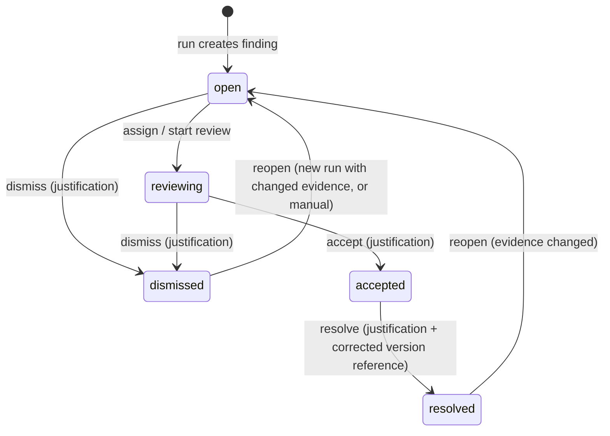
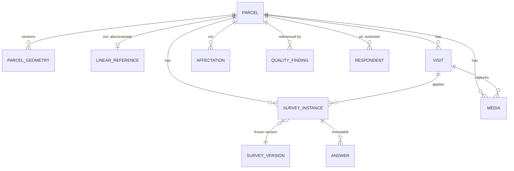

# Domain and data model (specification level)

> No migrations exist. Names are conceptual; table names will follow `snake_case` per module
> schema. Aligned with Gate 1 decisions D-013 (faceted provenance), D-015 (client access only via
> ClientPortalGrant), D-018 (privacy metadata) and D-019 (portal forecast). Every tenant-owned entity carries `tenant_id`; every project-scoped entity carries
> `(tenant_id, project_id)` with a composite FK to `project`. Every provenance-bearing entity
> carries `provenance_id` (ADR-005). Primary keys are UUID v7; business identifiers are separate
> unique columns per project.

## 1. Module map of the proposed decomposition (refined)

The brief's decomposition is kept, with additions marked **(+)** and moves marked **(→)**.

| Area | Entities |
|---|---|
| CORE | Tenant, User, TenantMembership, Role, Permission (+), Plan/Entitlement (+), Capability settings (+), Configuration (+) |
| PROJECTS | Project, ProjectMembership, ProjectProfile, ProjectUnit (+), Milestone (+), Deliverable, ActivityEvent (+), ForecastSnapshot (+), MetricSnapshot (+) |
| DOCUMENTS | SourceDocument, DocumentVersion, DocumentChunk (→ from "document intelligence"), DocumentLocator (+, value object) |
| GIS (core part) | SpatialDataset (+), SpatialDatasetVersion (+), Layer (+), Parcel, ParcelGeometry |
| GIS (linear_infrastructure extension) | Alignment/Road, Segment (= ProjectUnit kind), LinearReference (+), Affectation, AffectationItem (+) |
| FIELD | Assignment, Device (+), Visit, SurveyTemplate, SurveyVersion, Question, SurveyInstance, Answer, Media, Respondent/Household (+, in `pii` schema) |
| SOCIAL | Taxonomy, TaxonomyVersion, Category (+), CategoryProposal, ClassificationRun (+), AIClassification, HumanReview, AnswerCoding (+, derived), SocialMetric |
| QUALITY | Requirement, RequirementVersion (+), QualityRun (+), QualityFinding, FindingEvidence, SpecialistReview |
| REPORTS (later) | GeneratedReport, ReportVersion, GeneratedSection, Citation (+) |
| CLIENT PORTAL | PortalPublication (+), ClientPortalGrant (+) |
| PROVENANCE / TRACEABILITY | ProvenanceRecord (DataProvenance, faceted), ProvenanceInput (+ lineage), ImportRun, CalculationRun (+), AuditLog |
| AI | ModelDescriptor (+), PromptVersion (+), DeidentificationRun (+), AiVendor / ProcessorRegistry entry (+) |
| PRIVACY (D-018) | DataInventoryEntry (+), ProcessingPurpose (+), RetentionPolicy (+), ProcessorRegistryEntry (+), LegalBasisRecord / ConsentRecord (+), RiskAssessmentRecord (+), DataSubjectRequest (+, future) |

## 2. Aggregates and ownership boundaries

An aggregate is the unit of consistency: one transaction, one root, invariants enforced inside.
References across aggregates are by id only.

| Aggregate root | Contains | Owned by | Invariants inside |
|---|---|---|---|
| **Tenant** | memberships, capability settings, configuration, entitlements | core | last owner rule; allowed domains; MFA policy |
| **Project** | memberships, capability settings, configuration, profile snapshot, units, milestones, deliverables | projects | project override only restricts; lifecycle transitions |
| **Parcel** | geometry versions, linear reference (ext), attributes | gis | one current geometry; code unique per project; geometry provenance |
| **SpatialDatasetVersion** | layers, features | gis | immutable once imported; supersedes previous version; legend key derived from kind + provenance facets |
| **SurveyTemplate** | versions → questions | field | published version immutable |
| **SurveyInstance** | answers, links to visit/parcel/respondent | field | answers immutable after `submitted`; instance state machine |
| **Visit** | media refs, GPS, technician, result | field | belongs to a parcel and (optionally) an assignment |
| **Taxonomy** | versions → categories | social | published version immutable; proposals produce new versions |
| **AIClassification** | (leaf, immutable) | social | never updated; new run = new rows |
| **HumanReview** | (append-only) | social | references answer + optional classification + taxonomy version |
| **Requirement** | versions (rule definitions) | quality | language rules; applicability |
| **QualityFinding** | evidence items, specialist reviews | quality | state machine; justification mandatory on decisions |
| **SourceDocument** | versions → chunks | documents | version immutable; chunks derived from a version |
| **PortalPublication** | published projection (JSON validated by allowlist schema) | client-portal | contains no forbidden field by construction |
| **ProvenanceRecord** | inputs (lineage) | provenance | immutable once referenced |
| **ImportRun / CalculationRun / ClassificationRun / QualityRun** | progress, status, outputs summary | owning module | idempotent by id; regime and source type fixed at creation |

Dangerous couplings identified and how they are avoided:

| Coupling | Risk | Rule |
|---|---|---|
| Parcel ↔ road fields | core surveys assume abscissa | `Parcel` core has no linear fields; `LinearReference` is an extension row; field/social reference `parcel_id` only |
| Quality ↔ every table | FK sprawl, rules coupled to schemas | `FindingEvidence` holds a typed **locator** (kind + ids + position), validated per kind, not FKs to every table |
| Social analytics ↔ field tables | analytics reading raw answers or unvalidated codings | `social` consumes a `ValidatedAnswerView` read model published by `field` + its own `AnswerCoding` with status VALIDATED |
| Portal ↔ operational tables | leak by join | portal reads only `portal.*` projection rows written by `PortalPublication` |
| AI ↔ PII | identified text sent to providers | `ai` ports accept only `Deidentified<T>`; PII types live in `pii` schema and are not importable by `ai` |
| Reports ↔ live metrics | numbers drift after publication | reports store `MetricSnapshot` + `provenance_id` per figure |
| Forecast ↔ live counts | non-reproducible projection | `ForecastSnapshot` stores input snapshot, algorithm version, assumptions, timestamp |
| Parcel identity ↔ geometry source | replacing synthetic geometry rebuilds parcels | geometry is versioned (`ParcelGeometry` rows linked to `SpatialDatasetVersion`); parcel id is stable |
| Survey answers ↔ template changes | reinterpretation of history | `Answer` references `SurveyVersion` + `Question` (versioned); templates never mutate published versions |

## 3. Entity specifications

### 3.1 Core and projects

```
Project { id, tenant_id, slug, name, profile_key, profile_version, lifecycle: planning|field|analysis|review|delivered|closed,
          demo_mode: bool, target_date, owner_membership_id, crs (config), created_at }
ProjectUnit { id, tenant_id, project_id, kind: 'road_segment'|'sector'|'zone'|'site', code, name, order, geometry?, attributes jsonb, provenance_id }
Milestone { id, ..., key, label, state: planned|in_progress|completed, note, planned_at, completed_at, visible_in_portal: bool }
Deliverable { id, ..., name, note, due_at, state: planned|draft|review|approved|delivered, approved_by, document_version_id?, visible_in_portal }
ActivityEvent { id, ..., occurred_at, actor (membership or system), action_key, object_ref (typed), summary, provenance_id }
MetricSnapshot { id, ..., metric_key (enum), numeric_value | date_value, note, display_order, observed_at, provenance_id }
ForecastSnapshot { id, ..., algorithm_version, as_of_date, pending, daily_completions[], window_days, moving_average_per_day,
                   required_rate_per_day, active_technicians, assigned_technicians, target_date, projected_close_date, delay_days,
                   assumptions[], calculated_at, provenance_id }
```

#### Where a demo simulation's clock lives (IG1-009)

A demo dataset needs a fixed as-of date, or its figures drift with the machine's calendar and a
reviewer sees different numbers each session. That date is **not** a property of `Project`.

`Project` is a real consulting engagement. Putting `demo_scenario_date` on it would have leaked a
demonstration concern into the canonical entity every module builds on, and every future project —
including real ones — would have carried a column that means nothing to them.

The date belongs to the calculation it anchors, so it is `ForecastSnapshot.as_of_date`: the
`calculatedFrom` input, persisted so the result can be recomputed from the row alone. For a
`DEMO_SIMULATION` forecast that anchor *is* the scenario clock, and the regime on its provenance
record already says which kind it is. `demoScenarioDate(forecast, provenance)` is the whole rule.

The other demo instants are persisted on the rows that own them — `activity_event.occurred_at`,
the `captured_at` of the demo provenance records — derived at seed time from the fixture's
`demoScenario.scenarioDate`, which stays fixture metadata and reaches no table.

There is no `Scenario` entity, no scenario table and no scenario subsystem: one field, on the row
that already needed it. Historical observed values are untouched and keep their own capture dates
on their own provenance records; the two clocks live in different places precisely so they cannot
merge by accident.

#### MetricSnapshot is a curated projection, not the analytics store (IG1-002)

This is the scope boundary of the entity, and it is an invariant rather than a preference.

`MetricSnapshot` exists for one purpose: the handful of figures a coordinator reads at a glance
on the Command Center and the Portfolio card. It is a **read model** shaped for that surface —
one shape, one provenance link, one ordering — assembled from values that originate in several
modules.

It is **not** where measurements live. Every module keeps its own canonical model and remains
the source of truth for its data:

| Module | Canonical models |
|---|---|
| `gis` | Parcel, ParcelGeometry, Affectation, SpatialDatasetVersion |
| `field` | Assignment, Visit, SurveyInstance, Answer, Media |
| `social` | AnswerCoding, TaxonomyVersion, SocialMetric and its analytics read models |
| `quality` | QualityRun, QualityFinding, SpecialistReview |
| `documents`, `reports` | SourceDocument, DocumentVersion, GeneratedReport |

A module **projects** a selected output into a `MetricSnapshot` when the Command Center needs to
show it; it never stores its measurements here, and analytics never reads from here. Reports and
the portal snapshot the figures they publish, with the provenance id, exactly as before.

Three mechanisms keep the boundary from eroding:

1. `metric_key` is a PostgreSQL **enum**, so a caller cannot invent a key at runtime;
2. `packages/domain/test/metrics.test.ts` pins the exact curated set and asserts that
   module-owned measurements (parcel area, visit duration, coding score, open findings…) are
   *not* valid keys, so an addition has to be deliberate and reviewed;
3. the vocabulary is declared once, in `packages/domain/src/projects/metrics.ts`, with the rule
   written above it.

The question to ask before adding a key is "does a coordinator need this in the ten-second
glance?" — not "where can I put this number?".


### 3.2 Documents

```
SourceDocument { id, tenant_id, project_id, code ('DOC-118'), title, kind: report|annex|minutes|plan|legal|other, contains_pii: bool, current_version_id }
DocumentVersion { id, document_id, version_label ('v3'), storage_key, mime, sha256, page_count, imported_by, imported_at, import_run_id, provenance_id, immutable }
DocumentChunk { id, document_version_id, ordinal, page_from, page_to, section_path, text (redacted when contains_pii), token_count, embedding (vec schema, later) }
DocumentLocator (value) { document_version_id, page?, section?, chunk_id?, bbox?, quote? }
```

### 3.3 GIS

```
SpatialDataset { id, tenant_id, project_id, key ('parcels', 'alignment', 'basemap'), kind, current_version_id }
SpatialDatasetVersion { id, dataset_id, version_label ('parcels_v2'), import_run_id, source_crs, feature_count, supersedes_version_id?, provenance_id, immutable }
   -- legend key (REAL_BASE_MAP | RECONSTRUCTED_ALIGNMENT | SYNTHETIC_PARCELS | OFFICIAL_IMPORTED_ALIGNMENT | OFFICIAL_CADASTRE | FIELD_CAPTURED)
   -- is derived from dataset.kind + the facets of provenance_id (PROVENANCE.md §2.7), not stored
Layer { id, dataset_version_id, name, geometry_type, style_key, feature_source (table or storage key) }
Parcel { id, tenant_id, project_id, parcel_code (unique per project), unit_id?, status: confirmed|estimated|not_located|excluded,
         current_geometry_id?, attributes jsonb (profile-validated), provenance_id }
ParcelGeometry { id, parcel_id, dataset_version_id, geom geometry(Polygon,4326), area_m2 (computed in project CRS), centroid, valid_from, superseded_by?, provenance_id }
-- linear_infrastructure extension
Alignment { id, tenant_id, project_id, dataset_version_id, geom geometry(LineString,4326), length_m, station_origin_m, provenance_id }
LinearReference { parcel_id (PK), alignment_id, abscissa_m (declared), side: left|right|both, abscissa_computed_m?, computed_provenance_id? }
Affectation { id, parcel_id, instrument_instance_id?, total_area_m2, affected_area_m2, pct, state: draft|needs_review|validated, provenance_id }
AffectationItem { id, affectation_id, kind: strip|fence|crop|access|infrastructure|other, quantity, unit, note }
```

The parcel **operational state** shown on the map (Completo · Visitado · Pendiente · Requiere
revisita · Inconsistencia · No localizado) is a **derived read model**, computed from instrument
states, visits, open findings and `Parcel.status`, not a stored column that can drift.

### 3.4 Field

```
SurveyTemplate { id, tenant_id, project_id?, key ('socioeconomic_sheet'), name, current_version_id }
SurveyVersion { id, template_id, version_label ('v2'), status: draft|published|retired, published_at, schema_hash, requirements jsonb (min_photos: 4, require_gps), provenance_id }
Question { id, survey_version_id, key ('P17'), ordinal, kind: single|multiple|numeric|scale|open|photo|gps|signature, label, options jsonb, pii: bool, required }
Assignment { id, ..., technician_membership_id, parcel_ids[] or unit_id, planned_date, state }
Device { id, tenant_id, device_key, technician_membership_id, offline_enabled, last_sync_at }
Visit { id, ..., parcel_id, assignment_id?, technician_membership_id, device_id?, started_at, ended_at, duration, gps point, gps_accuracy_m,
        result: complete|revisit|not_found|refused, field_note, provenance_id }
SurveyInstance { id, ..., survey_version_id (immutable), parcel_id, visit_id?, respondent_id? (pii), state: not_started|in_progress|complete|needs_review|validated,
                 completeness_pct, submitted_at, validated_by, validated_at, capture_device_id?, provenance_id }
Answer { id, instance_id, question_id, value jsonb, value_text (open), captured_at, immutable_after_submit }
Media { id, ..., parcel_id, visit_id?, instance_id?, kind: photo|sketch|document|audio, storage_key, captured_at, gps?, gps_status: ok|missing|pending_sync, sha256, provenance_id }
pii.Respondent { id, tenant_id, project_id, parcel_id?, pseudonym ('HH-0412'), name, phone, id_number, consent_ref, retention_until }
```

Survey versioning invariant: a `SurveyInstance` references exactly one `SurveyVersion`; `Answer`
references a `Question` of that version. Publishing v2 never touches v1 instances. Aggregations
across versions require an explicit `QuestionMapping (from_question_id → to_question_id, method)`
recorded with provenance (ADR-006).

Instrument state semantics (spec §06): only `validated` feeds analytics and reports; `complete`
means filled, not reviewed.

### 3.5 Social intelligence

```
Taxonomy { id, tenant_id, project_id, key ('social_expectations'), current_version_id }
TaxonomyVersion { id, taxonomy_id, version_label ('v4'), status: draft|published|retired, published_by, published_at, immutable }
Category { id, taxonomy_version_id, key, parent_id?, label, definition, example, ordinal }
CategoryProposal { id, ..., taxonomy_version_id (base), proposed_label, proposed_definition, rationale, sample_answer_ids[], origin: ai|human,
                   model_ref?, state: proposed|reviewing|approved|modified|rejected, decided_by, decided_at, resulting_version_id? }
ClassificationRun { id, ..., taxonomy_version_id, model_descriptor_id, prompt_version_id, deidentification_run_id, scope (question/filter), started_at, finished_at, status }
AIClassification { id, ..., answer_id, run_id, taxonomy_version_id, suggested_category_id?, suggested_subcategory_id?, candidates jsonb [{category_id, score}],
                   model_score numeric(4,3), confidence_label: high|medium|low, thresholds_snapshot jsonb, rationale text, provider, model, model_version, prompt_version,
                   created_at, immutable }
HumanReview { id, ..., answer_id, classification_id?, action: accept|modify|new_category|reject|second_opinion|manual,
              validated_category_id?, validated_subcategory_id?, taxonomy_version_id, reviewer_membership_id, reviewed_at, note, immutable }
AnswerCoding (derived, materialised) { answer_id, status: unreviewed|low_confidence|disagreement|validated|rejected,
              validated_category_id?, taxonomy_version_id?, last_review_id?, ai_classification_id? }
SocialMetric { id, ..., metric_key ('P17.frequency'), segment jsonb, taxonomy_version_id?, value jsonb, n_base, as_of, provenance_id }   // facets incl. regime live on the provenance record
```

Three layers, three tables: `Answer` (immutable source), `AIClassification` (immutable
suggestion), `HumanReview` (append-only decision). The "current validated category" is a derived
projection (`AnswerCoding`) recomputed from reviews; analytics read only rows with status
`validated`, and every `SocialMetric` records which taxonomy version it was computed against.
"Disagreement" = two reviews with different validated categories and no final decision.

### 3.6 Quality gate

```
Requirement { id, tenant_id?, key ('rule.numeric_cross_doc'), title, finding_type: numerical_mismatch|geographical_mismatch|temporal_mismatch|document_completeness|cross_document_inconsistency|missing_evidence,
              default_severity, interdisciplinary_by_default, applicability (profile families, capability keys), current_version_id }
RequirementVersion { id, requirement_id, version_label, definition jsonb (inputs, comparison, tolerance keys), copy_templates (title, explanation, why, suggested_action), published_at, immutable }
QualityRun { id, ..., trigger: manual|scheduled|event, requirement_versions[], scope jsonb, started_at, finished_at, status, findings_created, findings_reopened, provenance_id }
QualityFinding { id, ..., finding_code ('QG-014'), run_id (first), last_run_id, requirement_version_id, fingerprint (dedupe across runs), type, severity: high|medium|low,
                 state: open|reviewing|accepted|dismissed|resolved, title, explanation, why_flagged, suggested_action, interdisciplinary_review_required: bool,
                 assignee_membership_id?, parcel_id?, detected_at, updated_at, provenance_id }
FindingEvidence { id, finding_id, role: source_a|source_b|context, locator jsonb (kind + ids + position, see below), label, quote text, captured_at }
SpecialistReview { id, finding_id, decision: accept|dismiss|resolve|reassign|request_interdisciplinary|reopen, justification text NOT NULL, reviewer_membership_id, reviewed_at, immutable }
```

Evidence locator kinds: `document_version {document_version_id, page?, section?, chunk_id?}`,
`dataset {dataset_key, version, filter?}`, `record {entity: parcel|survey_instance|visit|media, id, field?}`,
`layer {dataset_version_id, feature_id?}`, `metric {metric_snapshot_id}`. One finding can hold
many evidence items.

State machine (ADR-008):



### 3.7 Client portal

```
PortalPublication { id, tenant_id, project_id, version, published_by, published_at, projection jsonb (validated by PortalProjectionSchema), regime_summary,
                    published_forecast_snapshot_id? (only when client.portal.show_forecast is on; never DEMO_SIMULATION), provenance_id, state: draft|published|withdrawn }
ClientPortalGrant { id, tenant_id, project_id, user_id, state: invited|active|revoked, granted_by, expires_at }   // the ONLY representation of client access (D-015)
```

`PortalProjectionSchema` (zod, `strict()`) is an **allowlist**: overall progress, phase summary,
aggregate figures (with provenance facets), milestones flagged `visible_in_portal`, sector
progress (units, without parcel identifiers), deliverables flagged visible, published activities,
last update, legal note, and optionally one explicitly published forecast snapshot with its
provenance id, calculation time, algorithm version, assumptions and projection wording (D-019).
Anything else is unrepresentable (ADR-009).

### 3.8 Provenance and traceability

```
ProvenanceRecord { id, tenant_id, project_id?,
                   -- facets (Gate 1 D-013); the v0.2 SOURCE TYPE badges are derived in the UI, never stored
                   regime: HISTORICAL_OBSERVED|LIVE_OPERATIONAL|DEMO_SIMULATION,
                   origin: FIELD_CAPTURE|IMPORTED_DOCUMENT|IMPORTED_DATASET|SYSTEM_GENERATED (extensible),
                   transformations: ordered list of ORIGINAL|RECONSTRUCTED|DERIVED|ANONYMIZED,
                   granularity: INDIVIDUAL|AGGREGATE|null,
                   source_ref (document_version_id | dataset_version_id | import_run_id | capture ref),
                   version_label, captured_at, capture_medium: fieldflow|import|manual|calculation|ai, method_text (one-line formula/criterion, derived only),
                   calculation_run_id?, deidentification_run_id?, validation_status: validated|partial|pending|requires_specialist|not_required|not_validated,
                   validated_by?, validated_at?, note, created_at, immutable }
ProvenanceInput { provenance_id, input_provenance_id, role }   // lineage edges; transformations accumulate along the chain
ImportRun { id, tenant_id, project_id, kind: documents|gis|surveys|fixtures|taxonomy, source_descriptor jsonb, regime, default_origin, default_transformations, started_by, started_at, finished_at, status, stats jsonb, error_ref }
CalculationRun { id, ..., calculator_key, calculator_version, inputs_snapshot jsonb, assumptions jsonb, computed_at, provenance_id }
AuditLog (audit schema, append-only) { id, tenant_id, project_id?, actor_user_id?, actor_kind: user|system|job, action_key, object_kind, object_id, reason?, request_id, ip_hash, occurred_at, details jsonb (no PII values) }
```

### 3.9 Privacy-by-design metadata (Gate 1 D-018)

These entities let the product describe its own personal-data processing; they carry no legal
conclusions and are inputs to the compliance review that gates production ingestion of real PII.

```
DataInventoryEntry { id, tenant_id, dataset_key (e.g. 'survey.socioeconomic_sheet.v2', 'pii.respondent'), data_categories[] (identifiers, contact, economic, health, vulnerability, location, image),
                     data_subjects[] (respondent, household member, technician, client user), storage_location (schema/bucket prefix), pii: bool, owner_role, created_at }
ProcessingPurpose { id, tenant_id, key, description, inventory_entries[], legal_basis_kind? (free text/enumeration maintained by the tenant's compliance owner), active }
RetentionPolicy { id, tenant_id, inventory_entry_id, trigger: project_close|capture|delivery, months, action: anonymize|delete|archive, last_run_id? }
ProcessorRegistryEntry { id, tenant_id?, vendor_name, service (llm|embedding|storage|email|maps|analytics), region, data_categories_allowed[], contract_ref, status, ai_vendor: bool, model_families[] }
LegalBasisRecord / ConsentRecord { id, tenant_id, project_id, respondent_id (pii), basis_kind, reference (signed sheet, minute), captured_at, captured_by, withdrawn_at? }
RiskAssessmentRecord { id, tenant_id, project_id?, kind: dpia|risk_assessment, status, reference_document_version_id?, reviewed_at, reviewer }
DataSubjectRequest (future) { id, tenant_id, kind: access|rectification|erasure|objection, subject_ref, received_at, due_at, state, handled_by }
```

## 4. Historical vs live vs simulation

`regime` lives on `ProvenanceRecord` and is set by the producing run:

| Regime | Produced by | May appear in | Rendering |
|---|---|---|---|
| `HISTORICAL_OBSERVED` | imports of the real expedient, validated field captures of a real project | everything, deliverables, portal | no block badge; derived provenance label in drawer |
| `LIVE_OPERATIONAL` | field sync, quality runs, classifications on a live project | workspace, portal (aggregated, explicitly published), deliverables when validated | no block badge |
| `DEMO_SIMULATION` | fixture imports flagged demo, synthetic generators | workspace with badge; **never** deliverables; never published to the portal as client progress (D-019) | `DEMO / SYNTHETIC` badge derived from the block's provenance |

Regime is one of the four provenance facets (regime, origin, transformations, granularity;
PROVENANCE.md §2). Read models expose `{ value, provenance facets, provenanceId }` and the UI
figure component requires them; a block shows the DEMO badge when any composing value has regime
`DEMO_SIMULATION`. Exports refuse `DEMO_SIMULATION` values unless the export is explicitly a demo
export (watermarked). See PROVENANCE.md.

## 5. Parcel as territorial workspace



Identity rules: `id` (UUID) is the technical identity; `parcel_code` is the business identifier
(unique per project, pattern from configuration); owner name, coordinates and abscissa are never
identifiers. The Parcel Workspace tabs map to: Resumen (derived state + alerts + activity),
Visitas (`Visit`), Instrumentos (`SurveyInstance`), Afectaciones (extension), Media (`Media`),
Quality (`QualityFinding` where `parcel_id` matches or evidence locator references the parcel).

## 6. Open modelling questions for Gate 1

1. Should `Respondent`/household PII be one entity per parcel or per survey instance (a parcel
   can have several households)? Proposed: per respondent, linked to parcel, referenced by
   instance.
2. Do tenants need their own `Requirement` rules (custom quality rules) in v1, or only system
   rules with per-project parameters? Proposed: system rules + parameters; custom rules later.
3. Is `ProjectUnit` geometry required for portal "sectors" progress? Proposed: optional.
4. Should `AnswerCoding` be a materialised table or a view? Proposed: table maintained in the same
   transaction as `HumanReview`, for indexable queue filters.
