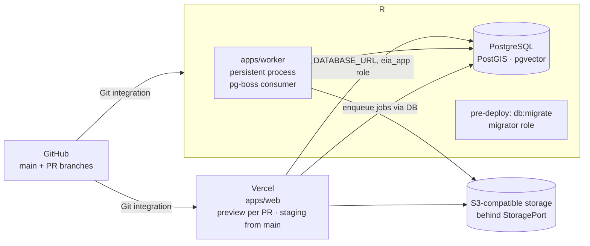

# Deployment topology and environment strategy

> Related: ADR-012 (deployment topology), ARCHITECTURE.md §9.1 (portability), SECURITY.md.
> Nothing is deployed yet. Production remains manual and gated.

## 1. Target topology



| Component | Where | Why |
|---|---|---|
| `apps/web` (Next.js: workspace + portal) | **Vercel** | Git integration, preview per PR, no server management; serverless limits are acceptable because long work is always a job |
| `apps/worker` (persistent Node process) | **Railway** service | needs a long-running process (GIS imports, document processing, quality runs, PDF rendering); Railway runs containers with health checks and restarts |
| PostgreSQL + PostGIS + pgvector | **Railway** Postgres initially, **subject to the database evaluation** (§4) | co-located with the worker; if the evaluation fails, a managed Postgres with the extensions (e.g. Neon, Supabase, Crunchy Bridge, RDS) is used without code change |
| Object storage | S3-compatible provider behind `StoragePort` | provider-neutral keys and presigned URLs; Railway buckets, Cloudflare R2 or AWS S3 are interchangeable |
| Email (invitations, magic links) | transactional email provider behind `EmailPort` | choose at Slice 0; env-configured |
| Base map tiles | configurable tile provider | env-configured key |

Rules:
- The web app is deployed **once** (Vercel). It is not also deployed to Railway; a documented
  reason (e.g. Vercel limits proven insufficient for a specific route) would be needed to add a
  second copy, and the preferred answer is to move the work into the worker.
- The worker is the only Railway app service; there is no separate API service. The web app
  talks to the database directly and enqueues jobs transactionally; the worker consumes them.
- Everything is configured by environment variables; no provider SDK inside `packages/domain`.

## 2. Environments

| Environment | Purpose | Web | Worker | Database | Data | Created |
|---|---|---|---|---|---|---|
| **local** | development | `next dev` | `worker` in watch mode | Docker Postgres (PostGIS+pgvector) or Testcontainers | generic factories + Zamora fixtures (synthetic/anonymised) | Slice 0 |
| **CI/test** | quality gates | built, not served (except e2e job) | tests only | Testcontainers, disposable per job | factories; no PII | Slice 0 |
| **PR preview** | review a change | Vercel preview per PR | none by default; a Railway PR environment only when backend/worker changes are materially needed (label `needs-backend-preview`) | shared **preview** database on Railway seeded with demo fixtures, reset nightly; never real data | demo only | after Slice 0 build |
| **staging** | persistent integration environment, mirrors production topology | Vercel staging project (from `main`) | Railway staging service (from `main`) | Railway staging Postgres | demo + anonymised; real PII forbidden until the compliance gate | after Slice 0 build |
| **production** | tenants | Vercel production (manual promote) | Railway production environment (manual) | production Postgres (Railway or evaluated alternative) | real, after gates | later |

Preview databases: Vercel previews must not point at staging data; they use the `preview`
database or, when a PR needs its own schema state, a Railway PR environment with its own
Postgres. Migrations for previews run from the PR branch against that disposable database.

## 3. Configuration and secrets (names only, never values in Git)

### 3.1 Application (web and worker)

| Variable | Used by | Notes |
|---|---|---|
| `NODE_ENV`, `APP_ENV` (`local|test|preview|staging|production`) | both | `APP_ENV` drives demo-mode guards and badge behaviour |
| `DATABASE_URL` | both | connection as `eia_app` (RLS enforced) |
| `DATABASE_MIGRATOR_URL` | migrations (pre-deploy) | `eia_migrator`; never available to the running app |
| `DATABASE_PORTAL_URL` | web (portal route group) | `eia_portal`, `portal` schema only |
| `BETTER_AUTH_SECRET`, `BETTER_AUTH_URL` | web | identity layer |
| `AUTH_TRUSTED_ORIGINS` | web | preview/staging origins |
| `STORAGE_ENDPOINT`, `STORAGE_REGION`, `STORAGE_BUCKET`, `STORAGE_ACCESS_KEY_ID`, `STORAGE_SECRET_ACCESS_KEY`, `STORAGE_FORCE_PATH_STYLE` | both | S3-compatible |
| `EMAIL_PROVIDER_API_KEY`, `EMAIL_FROM` | web, worker | invitations, notifications |
| `MAP_TILES_URL`, `MAP_TILES_API_KEY` | web (public part via `NEXT_PUBLIC_MAP_STYLE_URL`) | base map |
| `PUBLIC_APP_URL`, `PUBLIC_PORTAL_URL` | both | links in emails/PDFs |
| `WORKER_CONCURRENCY`, `WORKER_HEALTH_PORT` | worker | persistent process tuning |
| `OTEL_EXPORTER_OTLP_ENDPOINT`, `OTEL_EXPORTER_OTLP_HEADERS` | both (later, when there is workload) | observability |
| `SENTRY_DSN` (or equivalent) | both (later) | error tracking with scrubbing |
| `AI_PROVIDER`, `ANTHROPIC_API_KEY` / other provider keys | worker (later, after vendor registry + gate) | only registered vendors |
| `DEMO_FIXTURES_ENABLED` | both | allows seeding demo tenant; `false` in production |

### 3.2 GitHub repository secrets / variables

| Name | Needed when |
|---|---|
| `GITHUB_TOKEN` (built-in) | Changesets release PRs and tags (Stage F); needs `contents: write`, `pull-requests: write` |
| `RAILWAY_TOKEN` | only if CI-driven Railway deploys are adopted instead of Git integration |
| `VERCEL_TOKEN`, `VERCEL_ORG_ID`, `VERCEL_PROJECT_ID` | only if CI-driven Vercel deploys are adopted instead of Git integration (not planned) |
| `TURBO_TOKEN`, `TURBO_TEAM` | optional remote cache |

Repository **variables** (non-secret): `NODE_VERSION`, `PNPM_VERSION` if not read from files.

### 3.3 Vercel project (staging/preview)

- Project linked to the GitHub repo, root directory `apps/web`, framework Next.js, pnpm with
  `corepack`; build command runs Turborepo for the web app.
- Environment variables per environment (Preview / Production-as-staging): the application
  variables in §3.1 except migrator/worker ones. Values entered in the Vercel dashboard or via
  `vercel env add`, never committed.
- IDs to record (not secret, but not committed either): Vercel team/org id, project id
  (`.vercel/` is git-ignored).
- Production deployment on Vercel is disabled operationally by not assigning a production
  domain and by keeping the "Production Branch" pointed at `main` only for **staging** until
  the production project is created separately.

### 3.4 Railway project (staging)

- One project `eia-studio`, environment `staging`: services `worker`, `postgres` (with
  `postgis` and `vector` extensions confirmed), optional `preview-postgres`.
- Configuration as code in `railway.toml` at the repository root (to be added in Slice 0 when
  the worker exists; not before, to avoid deploying an empty service):

  ```toml
  # planned shape — added in Slice 0
  [build]
  builder = "NIXPACKS"            # or a Dockerfile under apps/worker
  buildCommand = "pnpm install --frozen-lockfile && pnpm --filter @eia/worker build"

  [deploy]
  startCommand = "pnpm --filter @eia/worker start"
  preDeployCommand = "pnpm db:migrate"   # runs with DATABASE_MIGRATOR_URL
  healthcheckPath = "/health"
  restartPolicyType = "ON_FAILURE"
  ```

- Secrets and variables are set per environment in Railway (dashboard or `railway variables
  set`), never in `railway.toml`.
- IDs to record: project id, environment id, service ids (used by the CLI; not secret, not
  committed).

## 4. Database evaluation before staging (Railway Postgres)

Confirm on the target Postgres image: PostgreSQL major version (17 is what local/CI use),
`CREATE EXTENSION postgis`, `vector`, `pg_trgm`, `gen_random_uuid()`; ability of the migrator
connection to create roles, including **`CREATE ROLE eia_policy ... BYPASSRLS`** (migration
0000; the SECURITY DEFINER membership helpers used inside RLS policies are owned by it — this
needs a superuser or a role with `CREATEROLE` + `BYPASSRLS`) and to `FORCE ROW LEVEL SECURITY`;
ability to create the runtime login role and `GRANT eia_app` to it; connection limits and
pooling mode (transaction pooling compatible with `set_config(..., true)`); automated backups
and point-in-time recovery; region/data-residency acceptable for the compliance review; storage
and CPU sizing for PostGIS indexes. If any item fails, choose a managed alternative with the
same extensions; the application does not change.

Local and CI image: `docker/postgres/Dockerfile` = `imresamu/postgis:17-3.5` (multi-arch
amd64/arm64 build of the official PostGIS image recipe, Debian bookworm + PGDG) plus
`postgresql-17-pgvector` from the same PGDG repository. Verified in Slice 0: PostgreSQL 17.6,
PostGIS 3.5.3, pgvector 0.8.6, pg_trgm 1.6. No maintained upstream image ships both extensions
(`postgis/postgis` lacks pgvector, `pgvector/pgvector` lacks PostGIS); see TECH_DEBT.md TD-001.

## 4a. Staging as actually built (Slice 0.5)

See `docs/STAGING_GATE_0_5.md` for the full capability report. Summary of what exists:

| Piece | Identifier |
|---|---|
| Railway project | `eia-studio-staging`, environment **`staging`** (the platform's default `production` environment is left empty and unused) |
| Database | service `postgres-gis`, built from `docker/postgres/Dockerfile`, volume at `/var/lib/postgresql/data`, reachable inside Railway at `postgres-gis.railway.internal:5432` and outside through a TCP proxy |
| Worker | service `worker`, Railpack build of `apps/worker`, `node apps/worker/dist/main.js` as PID 1, healthcheck `/health` |
| Web | Vercel project `eia-studio-web`, root directory `apps/web`, Node 24.x, GitHub integration connected, preview deployments only |

Two provider behaviours are load-bearing and were found the hard way:

1. **The worker must run Node directly.** With `pnpm --filter @eia/worker start` as the container
   command, pnpm becomes PID 1, SIGTERM does not reach the process's shutdown handler and the
   deployment reports a non-zero exit. The start command is `node apps/worker/dist/main.js`.
2. **Railway's stock Postgres has no PostGIS**, so migration 0000 cannot run on it. Staging uses
   our own image, which also required adding TLS (upstream PostGIS images ship without it).

## 5. Deployment sequence (staging, after Slice 0)

1. Merge to `main` → CI `quality` and `db` green.
2. Railway builds `worker`, runs `preDeployCommand` (migrations as migrator), starts the worker,
   health check passes.
3. Vercel builds `apps/web` from the same commit, deploys to the staging project.
4. Smoke check: `/health` on both, sign-in with the demo tenant, Portfolio renders, one job
   round-trips through pg-boss.
5. Rollback: redeploy the previous Railway deployment and Vercel deployment; migrations are
   forward-only, so a rollback that needs schema reversal is a new migration.

## 6. Production (later, gated)

Production is created only after the production-readiness gate: compliance review passed
(SECURITY.md §10a), hosting decision confirmed (ADR-012 revisited with evaluation results),
backups tested, security checks blocking in CI, runbooks written. Production deploys are
manual and explicit: a tagged release, a human-triggered promotion, never a push to `main`.

## 7. Repository and protection commands (for the developer to run)

```bash
# after confirmation — create the private repository and push (from the project root)
git init -b main
git add .
git commit -m "chore: bootstrap architecture documentation and delivery standards"
gh repo create eia-studio --private --source=. --remote=origin --push
```

```bash
# after the first CI run on main has produced the check name "ci / quality"
gh api -X PUT repos/{owner}/eia-studio/branches/main/protection \
  -H "Accept: application/vnd.github+json" \
  -F required_status_checks[strict]=true \
  -F 'required_status_checks[contexts][]=ci / quality' \
  -F enforce_admins=true \
  -F required_pull_request_reviews[required_approving_review_count]=0 \
  -F required_linear_history=true \
  -F allow_force_pushes=false \
  -F allow_deletions=false \
  -F restrictions=null
gh repo edit --enable-squash-merge --enable-merge-commit=false --enable-rebase-merge=false --delete-branch-on-merge
```

`{owner}` is the GitHub account or organisation chosen at creation. Status-check contexts are the
job names `quality` and `db` (workflow `ci`). Slice 0 note: on a GitHub Free personal plan a
private repository cannot have branch protection or rulesets (HTTP 403); see TECH_DEBT.md TD-014.
