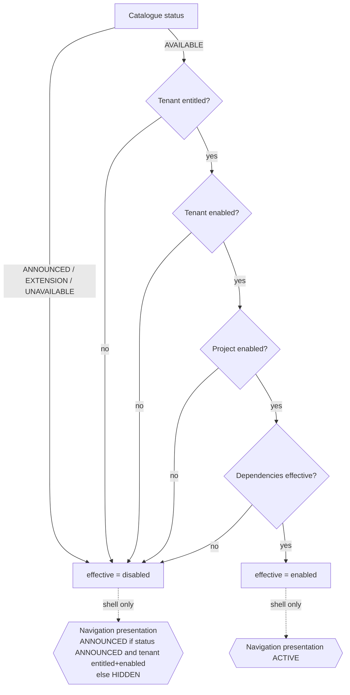

# Capabilities, configuration and project profiles

> Related: ADR-002 (capability resolution), ADR-003 (project profiles).
> Aligned with Gate 1 decisions D-014 (boolean capability resolution; navigation presentation is
> separate) and D-020 (no `field.offline_sync` capability; the catalogue stays at 14).

## 1. Capability vs configuration

| | Capability (feature) | Configuration |
|---|---|---|
| Question | Does this functionality exist here? | How does enabled functionality behave? |
| Examples | `social.ai_coding` enabled | `field.surveys.require_gps = true`, `client.portal.show_forecast = false`, `quality.document_gate.minimum_severity = medium`, `social.ai_coding.score_thresholds = {high: 0.75, medium: 0.60}` |
| Where decided | Product availability → tenant entitlement → tenant toggle → project toggle | Tenant defaults → project overrides, validated by a zod schema per capability |
| Protects | navigation, routes, server actions, APIs, jobs, domain object availability | behaviour inside a capability |
| Storage | `tenant_capability_setting`, `project_capability_setting` | `tenant_configuration`, `project_configuration` (typed JSON validated per key) |

Rule: do not turn configuration options into feature flags. A configuration key never hides a
route or a nav item; a capability never carries a numeric parameter.

## 2. Capability catalogue (centralised, as code)

`packages/domain/core/capabilities/catalog.ts` declares every capability once with typed metadata:

| Key | Module | Depends on | Product status (v0.2) | Pilot navigation presentation | Surfaces |
|---|---|---|---|---|---|
| `core.projects` | projects | — | AVAILABLE | ACTIVE | Portfolio, Command Center |
| `core.documents` | documents | `core.projects` | ANNOUNCED (rail item, no surface) | ANNOUNCED | Documents |
| `gis.maps` | gis | `core.projects` | AVAILABLE | ACTIVE | GIS / Parcel Explorer (map) |
| `gis.parcels` | gis | `gis.maps` | AVAILABLE | ACTIVE | Parcel Explorer table/panel, Parcel Workspace |
| `field.surveys` | field | `gis.parcels` | AVAILABLE (inbox only; FieldFlow mobile later) | ACTIVE | Field Surveys inbox |
| `social.analytics` | social | `field.surveys` | AVAILABLE | ACTIVE | Social Intelligence: closed variables |
| `social.ai_coding` | social | `social.analytics` | AVAILABLE | ACTIVE | Social Intelligence: open answers queue, taxonomy proposals |
| `quality.document_gate` | quality | `core.projects` | AVAILABLE | ACTIVE | Quality Gate |
| `quality.rag_assistant` | documents/ai | `core.documents` | ANNOUNCED | ANNOUNCED | RAG Assistant (embedded in tasks) |
| `reports.social_generator` | reports | `social.analytics`, `core.documents` | ANNOUNCED | ANNOUNCED ("FASE 3" in the rail) | Reports |
| `client.portal` | client-portal | `core.projects` | AVAILABLE | ACTIVE | Client Portal, "Client Portal" rail link |
| `climate.analytics` | (ext) | `core.projects` | EXTENSION | HIDDEN | none in workspace |
| `compliance.pma` | (ext) | `core.projects` | EXTENSION | HIDDEN | none in workspace |
| `audit.environmental` | (ext) | `core.projects` | EXTENSION | HIDDEN | none in workspace |

The catalogue is exactly the 14 approved keys. `field.offline_sync` (proposed in the phase
brief) is **not** added (Gate 1 D-020): whether offline behaviour is a capability or a
configuration such as `field.surveys.offline_mode = disabled | optional | required` is an open
decision for the Field slice, not Slice 0.

Each catalogue entry also declares: `label`, `description` (Spanish copy from Tenant Settings),
`enforcementPoints` (route prefixes, action names, job names), `whoCanEnable` (used by the
`feature disabled` state copy: "Un Owner puede activarlo en Tenant Settings › Módulos"), and a
`navigationPresentation` hint used only by the shell.

## 3. Resolution (boolean) and navigation presentation (separate)

Gate 1 D-014: **effective capability is a boolean**, `enabled | disabled`. It is the only value
authorization consults.

```
effective(cap, tenant, project) =
     PRODUCT_AVAILABLE(cap)             // catalogue status = AVAILABLE (a shipped surface or API)
  ∧  TENANT_ENTITLED(cap, tenant.plan)  // plan includes the capability ("Incluido" vs "Extensión")
  ∧  TENANT_ENABLED(cap, tenant)        // Tenant Settings › Módulos toggle
  ∧  PROJECT_ENABLED(cap, project)      // Project Settings › Modules & Capabilities toggle
  ∧  ∀ d ∈ dependsOn(cap): effective(d)  // dependencies must be effective too
```

Navigation presentation is a **separate, non-authorizing** value computed by the shell from the
catalogue status and the tenant's entitlement/toggle:

| Presentation | Rail | Route | Invocable (URL, API, server action, job, command) | When |
|---|---|---|---|---|
| `ACTIVE` | shown, navigable | active | yes, because `effective = enabled` | effective = enabled |
| `ANNOUNCED` | shown as a non-navigable placeholder ("FASE 3") | none | **no** — `effective = disabled` | product status ANNOUNCED and tenant entitled + enabled |
| `HIDDEN` | not shown | none (direct link → `feature disabled` state) | no — `effective = disabled` | everything else |

An ANNOUNCED module is **disabled** from the authorization perspective: `requireCapability`
throws `FeatureDisabled` for it exactly as for a HIDDEN one. The presentation value never reaches
`requireCapability`, route guards, handlers, jobs or the command palette's executable actions
(the palette may list an ANNOUNCED destination only as a disabled row, never as a command).

Pilot: Reports is navigation ANNOUNCED (and disabled); Climate Analytics, PMA Compliance and
Environmental Audit are navigation HIDDEN (and disabled).

Invariants:

- A project override can **never** enable a capability the tenant has not enabled or is not
  entitled to. Enforced at write time (the settings use-case rejects it) **and** at resolution
  time (the AND), so a corrupted row cannot widen access.
- Resolution happens once per request (or job) and the boolean result per key is part of the
  `RequestContext` (`CapabilitySet`). UI, routes, actions, handlers and jobs consult the same set.
- "Hiding a sidebar item is not authorization": every server entry point calls
  `requireCapability(ctx, key)` and every job handler calls it with its `JobContext`. A
  `FeatureDisabled` error is mapped to system state 7.
- Disabling a capability does not delete data; it makes the module's objects unavailable to
  navigation and mutation. Re-enabling restores access. Deleting data is a separate, audited
  operation.



## 4. Storage (specification level)

| Table | Columns | Notes |
|---|---|---|
| `plan` / `plan_entitlement` | plan_key, capability_key | product-level entitlement source ("Incluido"/"Extensión") |
| `tenant_capability_setting` | tenant_id, capability_key, enabled, changed_by, changed_at | absence = enabled if entitled (profile defaults apply at project level) |
| `project_capability_setting` | tenant_id, project_id, capability_key, enabled, changed_by, changed_at | absence = enabled; only restriction is meaningful |
| `tenant_configuration` | tenant_id, key, value (jsonb), version | validated by the schema registry |
| `project_configuration` | tenant_id, project_id, key, value (jsonb), version | overrides tenant value |

Configuration schema registry (`core/config/registry.ts`) maps each key to a zod schema, a
default, and the capability it belongs to; reading a configuration for a disabled capability is an
error, which prevents dead switches from influencing behaviour.

Initial configuration keys (examples, not exhaustive):

| Key | Type | Default | Used by |
|---|---|---|---|
| `project.crs` | EPSG code | required per project | gis metric computations |
| `project.parcel_code_pattern` | string pattern | `P-{seq:04}` | parcel code generation/validation |
| `project.locale` | locale | `es-EC` | formatting |
| `field.surveys.require_gps` | boolean | true | instrument validation |
| `field.surveys.gps_max_distance_m` | number | 100 | inbox state `GPS ALEJADO` |
| `field.surveys.offline_mode` (candidate, undecided — D-020) | enum disabled/optional/required | — | to be decided in the Field slice; may instead become a capability |
| `gis.abscissa_tolerance_m` | number | 30 | rule `rule.geo_abscissa_tolerance` (prototype: "Tolerancia configurada: 30 m") |
| `social.ai_coding.score_thresholds` | {high, medium} | {0.75, 0.60} | confidence labels (spec: adjustable per project) |
| `social.ai_coding.batch_size` | number | 100 | batch mode |
| `quality.document_gate.minimum_severity` | enum | low | which findings reach the inbox |
| `quality.document_gate.rule_set` | rule keys + versions | from profile | QualityRun |
| `client.portal.show_forecast` | boolean | **false** (D-019) | portal projection; when true, only explicitly published `ForecastSnapshot`s with provenance, calculation time, assumptions/version and projection wording; never `DEMO_SIMULATION` |
| `client.portal.language` | locale | project locale | portal |
| `forecast.window_days` | number | 5 | operational forecast (invariant 5 fixes 5; configurable window must keep the formula deterministic and stated) |

## 5. Project profiles (templates)

A **ProjectProfile** is a versioned template used at project creation. It is copied into the
project (snapshot semantics), and the project keeps `profile_key` + `profile_version` for
provenance. Editing a profile later never changes existing projects.

```
ProjectProfile {
  key: 'road_eia_social', version: 1, tenant_id: null (system) | tenant (custom copy),
  label, description,
  capabilities: { enabled: [...], disabled: [...] },
  configurationDefaults: { 'field.surveys.require_gps': true, ... },
  territorialModel: { unitKind: 'linear_corridor', extensions: ['linear_reference', 'affectation'] },
  instrumentTemplates: [ { surveyTemplateKey: 'socioeconomic_sheet', version: 2 }, ... ],
  taxonomySeeds: [ { taxonomyKey: 'social_expectations', version: 4 } ],
  qualityRuleSet: [ 'rule.numeric_cross_doc@1', 'rule.territorial_reference@1', ... ],
  milestoneTemplate: [ ... ],
}
```

### 5.1 First profile: `road_eia_social`

| | |
|---|---|
| Enabled | core.projects, core.documents, gis.maps, gis.parcels, field.surveys, social.analytics, social.ai_coding, quality.document_gate, quality.rag_assistant, reports.social_generator, client.portal |
| Disabled | climate.analytics, compliance.pma, audit.environmental |
| Territorial model | linear corridor: `Road` alignment, `ProjectUnit` of kind `road_segment` (tramos with abscissa ranges), `Parcel` with `LinearReference` (abscissa, side) and `Affectation` |
| Instruments | socioeconomic sheet (main), ecosystem services, parcel affectation, attendance register |
| Quality rules | numeric cross-document, territorial reference, temporal plan vs report, legal vs social contrast, media completeness, document completeness, geo abscissa tolerance |

The prototype card describes it as "Corredor vial con predios frentistas, abscisado, ficha
socioeconómica por predio, consulta significativa y generación de capítulo social" and offers
"Duplicar plantilla" to create a second one; duplication = copy + edit of the profile record.

### 5.2 Extension model (pragmatic middle)

The core must not assume every project has a road, parcels with abscissas, or segments. It also
must not become a meta-platform. The recommended shape (ADR-003):

- **Core concepts** every profile has: `Project`, `ProjectUnit` (a named sub-area with optional
  geometry: segment, sector, zone, site), `Parcel` (a territorial unit of analysis with optional
  geometry and a business code), `Visit`, `SurveyInstance`, `Media`, `Document`, `Finding`.
- **Profile families** add typed extension tables, not JSON: `linear_infrastructure` adds
  `alignment`, `linear_reference (parcel_id, abscissa_m, side)`, `affectation`. A future
  `site_facility` family might add `buffer_zone`. Extensions are activated by the profile and
  guarded by capability keys under `gis.*`.
- Minor per-profile attributes may live in a validated `attributes jsonb` on `Parcel` and
  `ProjectUnit`, with the schema declared by the profile.
- UI columns and tabs that belong to an extension (abscissa column, Afectaciones tab) are declared
  by the extension, not hardcoded in the parcel screen.

## 6. Enforcement points checklist

For every capability the catalogue entry lists where it is enforced; CI verifies that each listed
route prefix, action and job has a `requireCapability` call (a static check over the registry).

| Point | Mechanism |
|---|---|
| Navigation | rail/palette generated from `CapabilitySet` (boolean) plus the shell-only presentation hint (ACTIVE/ANNOUNCED/HIDDEN); ANNOUNCED rows are never executable |
| Routes | layout-level guard per route prefix → `feature disabled` state |
| Server actions | `withContext(requireCapability(key))(handler)` wrapper |
| Route handlers / APIs | same wrapper |
| Jobs | `JobContext` + `requireCapability` at handler start; enqueue also checks |
| Domain objects | use-cases of a module refuse to create objects when its capability is not effective |
