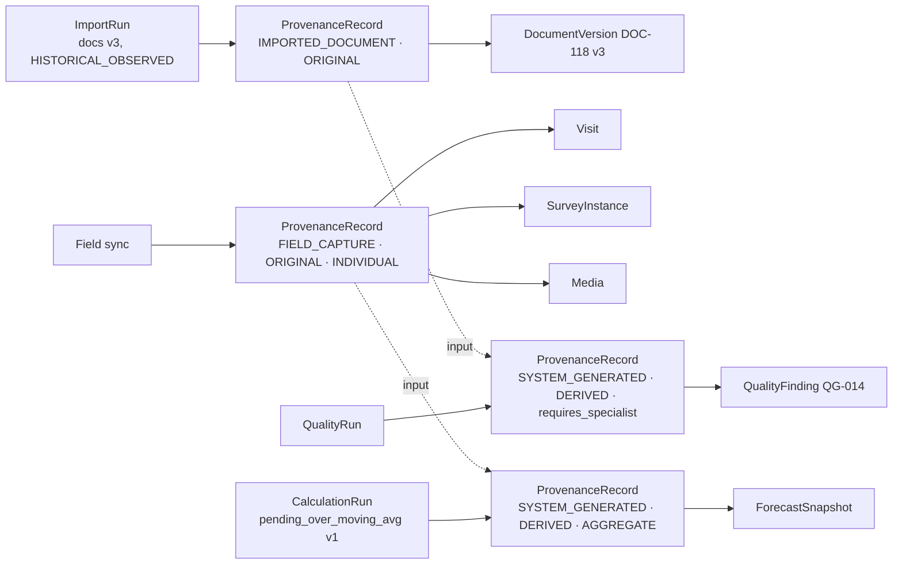

# Data provenance, regimes and reproducibility

> Related: ADR-005. Invariants 4, 5, 12, 13 of the README; spec §04 and §09.
> Aligned with Gate 1 decisions D-013 (faceted provenance) and D-019 (portal forecast).

## 1. What provenance must answer

For any published figure, layer, parcel, variable, open answer, finding or (future) report
paragraph, the "Ver origen" drawer must answer:

| Drawer field | Content |
|---|---|
| SOURCE TYPE | one of the vocabulary values, with a contextual note |
| SOURCE / DATASET | document, layer or dataset with its identifier |
| VERSIÓN | version of the document, layer or taxonomy in force when computed |
| CAPTURADO / IMPORTADO | date and medium (FieldFlow, import, manual load) |
| MÉTODO | one-line formula or criterion, derived values only |
| HUMAN VALIDATION | validated · partial · pending · requires specialist (+ not required / not validated as seen in the prototype), with author and date |
| Actions | "Abrir dataset", "Ver registros base" |

## 2. Vocabularies (Gate 1 decision D-013: provenance is faceted)

A single "source type" enum mixed independent concepts (where a value came from, what happened
to it, whether it is real, and whether it is one record or a count). The canonical backend model
is therefore **four facets** on every `ProvenanceRecord`. The four SOURCE TYPE badges approved in
design v0.2 (`REAL_AGGREGATE` · `RECONSTRUCTED` · `ANONYMIZED` · `SYNTHETIC`) are a
**presentation concern of the current demo**, derived from the facets (§2.6). They are not stored.

### 2.1 Regime (required)

| Value | Meaning |
|---|---|
| `HISTORICAL_OBSERVED` | real data of a real study, observed or recorded in the past |
| `LIVE_OPERATIONAL` | data produced by the running operation of a live project |
| `DEMO_SIMULATION` | generated or simulated for demonstration; never historical truth, never a deliverable |

### 2.2 Origin (required, extensible)

| Value | Meaning | Examples |
|---|---|---|
| `FIELD_CAPTURE` | captured by a technician/device in the field | visit, instrument instance, photo |
| `IMPORTED_DOCUMENT` | taken from a document of the expedient (report, annex, minutes) | the parcel count stated in the social report |
| `IMPORTED_DATASET` | taken from a structured external dataset or layer | official GIS layer, survey export, anonymised answer set |
| `SYSTEM_GENERATED` | produced by EIA Studio itself (calculation, generator, rule engine, AI) | forecast, KPI count, finding, synthetic parcels |

The list is extensible (e.g. a future `EXTERNAL_API`); new values require an ADR amendment and a
presentation mapping entry.

### 2.3 Transformation (required; ordered list)

A lineage can undergo more than one transformation over time, so the record stores an **ordered
list** of transformations applied since origin (the last element is the "current" transformation
used for labelling), and lineage edges point at the previous records.

| Value | Meaning |
|---|---|
| `ORIGINAL` | as captured or imported, no transformation |
| `RECONSTRUCTED` | approximation of a real-world object from partial sources by a declared method (e.g. alignment drawn from map references) |
| `DERIVED` | computed from other provenance-bearing values by a recorded calculation or rule |
| `ANONYMIZED` | identifiers removed or replaced by a recorded deidentification run |

Example lineages: `[ORIGINAL]` (an imported document figure); `[ANONYMIZED]` (an anonymised
answer set imported for evaluation); `[ANONYMIZED, DERIVED]` (a frequency computed over that
set); `[RECONSTRUCTED, DERIVED]` (a linear reference computed against a reconstructed alignment).

### 2.4 Granularity (when applicable)

| Value | Meaning |
|---|---|
| `INDIVIDUAL` | one record about one unit (a parcel, a respondent, an answer, a visit) |
| `AGGREGATE` | a count, sum, frequency or other summary over many units |
| (null) | not applicable (e.g. a document version, a layer) |

### 2.5 Worked examples

| Value shown | regime | origin | transformation | granularity | v0.2 badge (derived) |
|---|---|---|---|---|---|
| 141 roadside parcels (from the report) | HISTORICAL_OBSERVED | IMPORTED_DOCUMENT | [ORIGINAL] | AGGREGATE | REAL_AGGREGATE |
| Anonymised historical open answer used for AI evaluation | HISTORICAL_OBSERVED | IMPORTED_DATASET | [ANONYMIZED] | INDIVIDUAL | ANONYMIZED |
| P17 frequency over validated answers | HISTORICAL_OBSERVED | SYSTEM_GENERATED | [ANONYMIZED, DERIVED] | AGGREGATE | ANONYMIZED |
| Reconstructed corridor alignment | HISTORICAL_OBSERVED | IMPORTED_DATASET | [RECONSTRUCTED] | (n/a) | RECONSTRUCTED |
| Synthetic parcel polygons | DEMO_SIMULATION | SYSTEM_GENERATED | [ORIGINAL] | INDIVIDUAL | SYNTHETIC |
| Operational forecast on simulated inputs | DEMO_SIMULATION | SYSTEM_GENERATED | [DERIVED] | AGGREGATE | SYNTHETIC |
| Operational forecast on a live project | LIVE_OPERATIONAL | SYSTEM_GENERATED | [DERIVED] | AGGREGATE | RECONSTRUCTED (v0.2 label for derived values) |
| A visit synced from the field | LIVE_OPERATIONAL | FIELD_CAPTURE | [ORIGINAL] | INDIVIDUAL | (no badge) |
| Quality finding QG-014 | HISTORICAL_OBSERVED | SYSTEM_GENERATED | [DERIVED] | (n/a) | RECONSTRUCTED |

### 2.6 Deriving UI provenance labels from the facets

The drawer and badges use a pure presentation function `provenanceLabel(record) → label` with
this precedence (first match wins):

1. `regime = DEMO_SIMULATION` → **SYNTHETIC** (plus the `DEMO / SYNTHETIC` block badge).
2. `ANONYMIZED ∈ transformations` → **ANONYMIZED**.
3. last transformation ∈ {`RECONSTRUCTED`, `DERIVED`} → **RECONSTRUCTED** (the v0.2 label; the
   drawer's contextual note states "derived by calculation" vs "reconstructed approximation").
4. `transformation = [ORIGINAL]` and `granularity = AGGREGATE` → **REAL_AGGREGATE**.
5. otherwise (original individual records: field captures, imported records, documents) → no
   badge; the drawer shows origin and capture medium ("CAPTURADO · FieldFlow", "IMPORTADO").

The mapping is data (a table in `packages/ui`), not logic scattered in components, so a later
design iteration can rename labels (e.g. split DERIVED from RECONSTRUCTED) without touching the
backend model. The drawer always shows the four raw facets under the label for auditability.

### 2.7 Layer provenance (spatial, presentation keys)

`REAL_BASE_MAP` · `RECONSTRUCTED_ALIGNMENT` · `SYNTHETIC_PARCELS` · `OFFICIAL_IMPORTED_ALIGNMENT`
· `OFFICIAL_CADASTRE` · `FIELD_CAPTURED` are legend keys derived from the dataset kind plus the
facets of the `SpatialDatasetVersion` record (e.g. parcels + DEMO_SIMULATION → SYNTHETIC_PARCELS;
alignment + [RECONSTRUCTED] → RECONSTRUCTED_ALIGNMENT; alignment + IMPORTED_DATASET + [ORIGINAL]
→ OFFICIAL_IMPORTED_ALIGNMENT). The legend is mandatory on every map, including the Command
Center thumbnail.

### 2.8 Validation status

`validated` · `partial` · `pending` · `requires_specialist` · `not_required` (deterministic
calculations) · `not_validated` (e.g. a synthetic layer awaiting replacement).

## 3. Implementation patterns evaluated

| Pattern | Description | Pros | Cons |
|---|---|---|---|
| A. Columns everywhere | `source_type`, `regime`, `captured_at`, `method`, `validated_by`… on every table | trivial reads; no joins | duplication and drift; lineage impossible; the drawer needs per-table code; developers omit columns on new tables |
| B. Central polymorphic table | `provenance(subject_type, subject_id, …)` | one table, one drawer query | no FK integrity to subjects; orphan/missing rows undetectable; lookups by subject need indexes per type |
| C. Run-level provenance + FK | provenance lives on runs (`ImportRun`, `CalculationRun`…); each record carries a single NOT NULL `provenance_id` | integrity by FK; runs are the natural unit of "where did this come from"; cheap to add to a new table (one column) | derived values need their own record (fine: a `CalculationRun` creates them); a record can only point to one provenance (lineage handled by edges) |
| D. Event-sourced lineage graph | every mutation is an event; provenance is a query over the event log | complete history | far more infrastructure than the product needs; hard to expose as the six-field drawer |

**Recommendation: C, with B's central table as the FK target and lineage edges.**

- `ProvenanceRecord` is the single table (immutable rows) carrying the four facets (regime,
  origin, transformations, granularity). Runs create records; records are reused by every row
  produced by that run (an import of a parcel layer creates one record, not one per parcel).
- Derived values (a KPI, a forecast, a metric, a finding) get their own record whose
  `method_text`, `calculation_run_id` and `ProvenanceInput` edges point at the inputs.
- Every provenance-bearing table has `provenance_id NOT NULL REFERENCES provenance_record`.
  A lint/CI check lists tables in the "provenance-bearing" registry and fails if the column is
  missing.
- The drawer is one query: `provenance_record` + inputs + the referenced document/dataset labels.
- Regime is on the record, so it propagates automatically to everything a demo import creates.

Trade-off accepted: a row cannot change provenance without pointing at a new record; that is
intended (history is preserved, corrections are new runs).

## 4. Invocation points and read-model contract

Every read model that feeds a screen returns values as `Sourced<T> = { value: T, provenance:
{ regime, origin, transformations, granularity }, provenanceId, validation }`. The UI cannot render
a `Sourced` figure without a `ProvenanceLink`, and a block cannot omit the DEMO badge when any of
its `Sourced` values has regime `DEMO_SIMULATION`. This makes invariant 12 ("if it cannot say
where it comes from, it is not shown as a publishable figure") a type-level rule. Labels are
derived by the presentation mapping in §2.6.

Invocation points to support from day one: KPI strip, forecast, consultation figure, map layer,
parcel context panel, parcel instruments, closed variable, open answer, finding detail. Reserved:
generated report paragraph/figure.

## 5. Operational forecast (deterministic)

Contract (invariant 5): `days_remaining = pending ÷ moving_average(completed_per_day, 5 days)`;
`projected_close = as_of + days_remaining`; `rate_required = pending ÷ working_days_to_target`.
Not a model, not AI, no probabilistic language.

`ForecastSnapshot` stores: `algorithm_key`, `algorithm_version`, `window_days`, the input snapshot
(pending count, the daily series used, active technicians, target date, as-of), the assumptions
shown on screen (e.g. "6 parcels/technician on accessible segments · 2 revisits per 10 visits ·
no rain days"), the result, and `computed_at`, with a provenance record (origin
`SYSTEM_GENERATED`, transformation `[DERIVED]`, granularity `AGGREGATE`, regime inherited from
the inputs) whose input edges link to the metric snapshots used. Recomputed on each sync; older
snapshots are kept so the Command Center can show "recalculado en cada sync" and an auditor can
reproduce by hand. Unsynced records are excluded from inputs and the exclusion count is stored
(state 12).

Client Portal rule (Gate 1 decision D-019): `client.portal.show_forecast` defaults to `false`.
When a project enables it, only **explicitly published** `ForecastSnapshot`s enter a
`PortalPublication`, each carrying its provenance id, calculation time, algorithm version and
assumptions, and rendered with clear projection wording ("proyección aritmética al ritmo
observado", never a promise or a probability). A snapshot whose regime is `DEMO_SIMULATION` can
never be published as client progress; the publication validator rejects it.

## 6. Spatial provenance and replacement of reconstructed layers

- A layer is never edited in place. The official alignment arrives as a new `ImportRun` → new
  `SpatialDatasetVersion` with `OFFICIAL_IMPORTED_ALIGNMENT`, superseding the reconstructed one.
- Parcels keep their ids and codes; `ParcelGeometry` rows from an official cadastre supersede
  synthetic ones per parcel via a matching step (by code or spatial overlap) recorded as a
  `CalculationRun` with its method and unmatched counts (feeds the `partial GIS` state).
- Linear references are recomputed against the new alignment with a record whose transformation
  list appends `DERIVED`; declared abscissas remain as captured (`FIELD_CAPTURE`, `[ORIGINAL]`)
  and the geo tolerance rule compares the two.
- Nothing in `projects`, `field` or `social` changes when a layer is replaced.

## 7. Historical vs live vs demo enforcement

| Guard | Where |
|---|---|
| Regime fixed at run creation; records inherit it | provenance module |
| Fixture manifests must declare regime; `DEMO_SIMULATION` fixtures cannot be imported into a project whose `demo_mode = false` | import use-case |
| Read models carry regime; UI derives badges | contracts + ui |
| Exports and report generation reject `DEMO_SIMULATION` inputs unless `export.kind = demo` (watermarked) | reports / export use-cases |
| Portal publication schema requires the provenance facets on every figure and rejects `DEMO_SIMULATION` unless the project is a demo tenant; forecast snapshots enter only when explicitly published and never with `DEMO_SIMULATION` (D-019) | client-portal |
| Tests: seeding demo metrics next to historical figures produces badged blocks; exporting fails | TESTING_STRATEGY.md |

## 8. Audit vs provenance

Provenance answers "where does this value come from"; audit answers "who did what, when". They
are separate stores: audit is append-only security data (never shown in the portal), provenance
is product data shown in the drawer. Specialist reviews, human validations and publications write
both.
