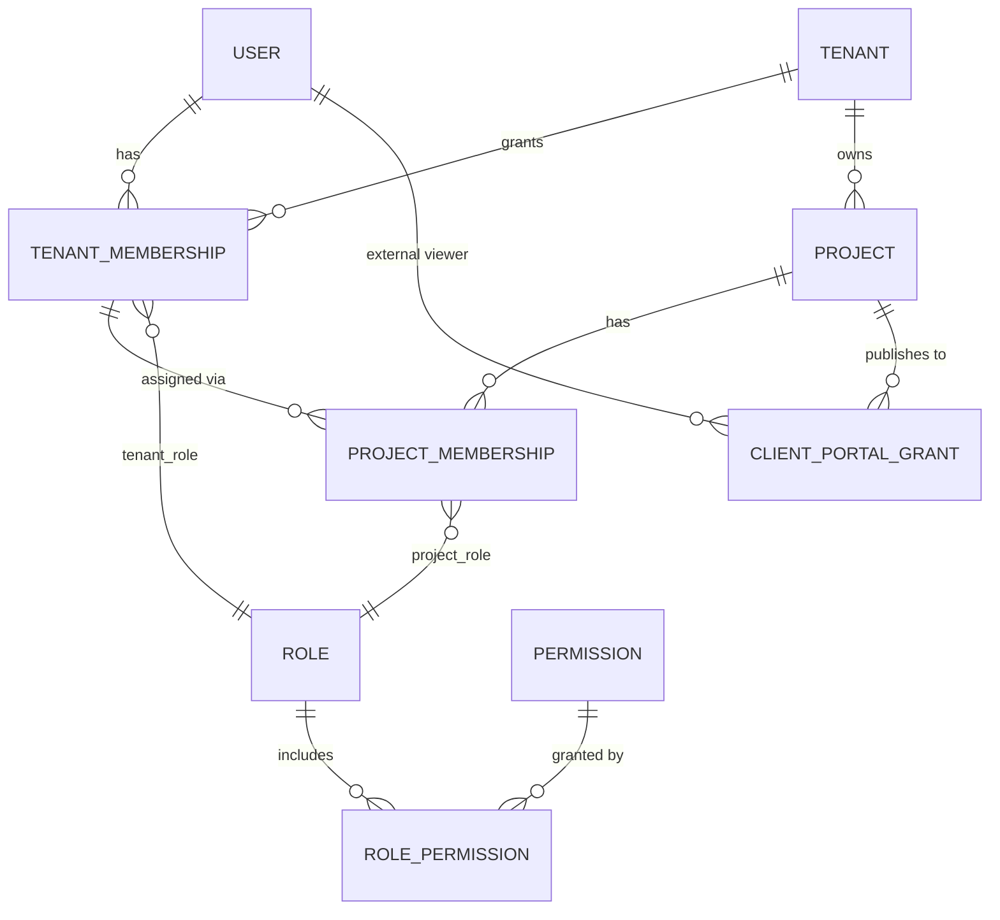

# Tenancy, membership and authorization model

> Related: ADR-001 (multi-tenancy), ADR-004 (RLS), ADR-009 (client portal), ADR-010 (identity
> provider boundary), `docs/SECURITY.md`. Aligned with Gate 1 decisions D-015 (roles) and D-016
> (Better Auth scope).

## 1. Concepts



| Entity | Meaning | Key attributes |
|---|---|---|
| **User** | Global identity (one person, one login); the identity provider (Better Auth, ADR-010) owns credentials and sessions, EIA Studio owns everything below | id, email (unique), name, mfa_enrolled, status, identity_provider_subject |
| **Tenant** | An organisation, normally a consulting firm | id, slug, name, plan, status, settings (allowed email domains, PII retention policy, MFA policy) |
| **TenantMembership** | A user's membership in one tenant | id, tenant_id, user_id, tenant_role, status (invited / active / suspended), invited_by, accepted_at |
| **Project** | Belongs to exactly one tenant | id, tenant_id, slug, name, profile_key, profile_version, lifecycle, settings |
| **ProjectMembership** | Assignment of a **tenant membership** (not a raw user) to a project | id, tenant_id, project_id, tenant_membership_id, project_role, status |
| **Role** | Named permission bundle; scope = `tenant` or `project` | key, scope, system (bool), permissions[] |
| **Permission** | Atomic action key in a catalogue | key (e.g. `parcels.write`, `pii.read`, `deliverables.approve`), scope |
| **ClientPortalGrant** | External read-only access to one project's **published** portal projection | id, tenant_id, project_id, user_id, status, granted_by, expires_at |

Design choices:

1. `ProjectMembership` references `TenantMembership`, not `User`. A project assignment therefore
   cannot exist without an active tenant membership, and suspending the tenant membership
   suspends every project assignment atomically.
2. A user may belong to many tenants; nothing about a user is tenant-owned except memberships.
3. A project belongs to one tenant; the `(tenant_id, project_id)` pair is carried by every
   project-scoped row and enforced by composite foreign keys.
4. Client users are **not** project members. `CLIENT` is not a `ProjectMembership` role
   (Gate 1 D-015). Client access is represented **exclusively** through `ClientPortalGrant`,
   which is only consulted by the portal surface. The prototype's "Usuarios" table lists the
   client as a row with role "Cliente (read-only)"; the UI can list grants alongside memberships,
   but the models are distinct so internal permission resolution never sees client rows.

## 2. Roles (Gate 1 D-015)

### 2.1 Tenant roles

| Role | Meaning | Tenant-wide permissions | Project data access |
|---|---|---|---|
| `OWNER` | Organisation-wide control; cannot be removed if last owner | all administrative permissions: `tenant.transfer`, `tenant.delete`, `billing.manage`, `members.manage`, `roles.assign`, `modules.manage`, `templates.manage`, `security.manage`, `integrations.manage`, `projects.create`, `projects.archive`, `audit.read`, `portfolio.read` | **Implicit access to every project of the tenant**, computed (never stored) as the `COORDINATOR` permission set. PII access under this implicit access remains subject to the PII resource policy and is **always audited**. |
| `ADMIN` | Tenant and project administration | `members.manage`, `roles.assign` (not above ADMIN), `modules.manage`, `templates.manage`, `security.manage`, `integrations.manage`, `projects.create`, `projects.archive`, `project.members.manage`, `audit.read`, `portfolio.read` (all projects: names, state, progress only) | **No implicit access to sensitive project data.** Reading or writing project data (parcels, surveys, PII, social, quality, documents) requires an explicit `ProjectMembership` with a project role. |
| `MEMBER` | Staff without administrative rights | `portfolio.read` (own projects only), `profile.self` | Only through explicit `ProjectMembership`. No implicit administrative access. |

### 2.2 Project roles

Derived from the README role list and the prototype matrix (PRODUCT.md §3):

| Role | Label (UI) | Permissions (project scope) |
|---|---|---|
| `COORDINATOR` | Coordinador de proyecto | project.configure, project.members.manage, parcels.write, field.write, field.validate, social.read, quality.write, reports.write, deliverables.approve, portal.publish, pii.read (audited) |
| `SOCIAL_SPECIALIST` | Especialista social | parcels.read, field.read, social.write (coding, taxonomy proposal decisions), quality.write, reports.write, pii.read, pii.export (audited) |
| `ENVIRONMENTAL_SPECIALIST` | Especialista ambiental | parcels.read, field.read, documents.write, quality.write, reports.write |
| `GIS_SPECIALIST` | Cartógrafo / GIS | parcels.write, geometry.import, field.read (no PII), quality.read |
| `FIELD_TECHNICIAN` | Técnico de campo | parcels.read, field.assignments.read_own, field.capture (own assignments), media.upload |
| `REVIEWER` | Revisor | documents.read, quality.review (decide findings), reports.review |
| `VIEWER` | Internal read-only | *.read except pii |

There is no `CLIENT` project role. Client access = `ClientPortalGrant` only (§1, ADR-009).

### 2.3 Notes vs the bundle

- The prototype matrix has no column for "Revisor" nor for "Especialista ambiental"; Gate 1
  confirmed both as explicit project roles (`REVIEWER`, `ENVIRONMENTAL_SPECIALIST`).
- The prototype shows the owner with projects "Todos": modelled as the OWNER's implicit,
  computed project access. The prototype does not show an ADMIN; ADMIN has no implicit project
  data access.
- "Proyectos y configuración RW" for the coordinator is read as **project** configuration, not
  tenant administration.
- "Aprobación de entregables = A" for Admin and Coord. is modelled as `deliverables.approve`,
  held by `COORDINATOR` (and by OWNER through implicit access); an ADMIN needs a project
  membership to approve.
- Custom roles per tenant are **not** in v0.2; the model allows them later (`Role.system = false`)
  without schema change, but they are intentionally out of scope.

## 3. Permission catalogue (specification level)

Permissions are typed keys grouped by module, declared in `core/authz/permissions.ts`:

```
tenant:    tenant.transfer, tenant.delete, billing.manage, members.manage, roles.assign,
           modules.manage, templates.manage, security.manage, integrations.manage,
           projects.create, projects.archive, audit.read, portfolio.read
project:   project.configure, project.members.manage, parcels.read, parcels.write,
           geometry.import, field.read, field.campaigns.manage, field.assignments.manage,
           field.assignments.read_own, field.responses.read,
           field.capture, field.validate, field.write,
           media.upload, documents.read, documents.write, social.read, social.write,
           social.ai.run, social.coding.review,
           taxonomy.approve, quality.read, quality.write, quality.review,
           reports.write, reports.review, deliverables.approve, portal.publish,
           pii.read, pii.export, provenance.read
portal:    portal.view   (only valid inside PortalContext)
```

Rules:
- A permission is either tenant-scoped or project-scoped, never both.
- Capability gates and permission gates are independent: `social.write` on a project where
  `social.ai_coding` is disabled still cannot invoke AI coding (FEATURES.md).
- `pii.*` permissions are additionally subject to a resource policy (the project must have PII
  enabled, the user must have accepted the confidentiality notice) and are always audited.

### 3.1 Field permissions, and why reading responses is its own grant (Slice 3)

`field.read` and `field.responses.read` are different permissions, and the distinction is the one
place in the product where project access is deliberately not enough.

| Key | Grants | Held by |
|---|---|---|
| `field.read` | the operational workflow: campaigns, their progress, assignments and per-technician counts | COORDINATOR, SOCIAL_SPECIALIST, ENVIRONMENTAL_SPECIALIST, GIS_SPECIALIST, REVIEWER, VIEWER |
| `field.campaigns.manage` | create, activate and close campaigns | COORDINATOR |
| `field.assignments.manage` | assign and reassign work | COORDINATOR |
| `field.assignments.read_own` | see *my* assignments and nobody else's | FIELD_TECHNICIAN (and implied for anyone with `field.read`) |
| `field.capture` | start a visit, save a draft, submit a response — on my own assignments | FIELD_TECHNICIAN, COORDINATOR |
| `field.responses.read` | read an individual response and its answers, whoever captured it | COORDINATOR, SOCIAL_SPECIALIST, REVIEWER |

A `FIELD_TECHNICIAN` holds neither `field.read` nor `field.responses.read`: they see their own
work and no one else's. A `GIS_SPECIALIST` holds `field.read` but not `field.responses.read`: they
can see that a parcel has been visited without reading what a household answered.

This is enforced twice. The use-cases check the permission; and the row-level policies on
`field_assignment`, `field_visit`, `survey_instance` and `survey_answer` add *either this row is
the caller's own, or the caller holds `field.responses.read`* on top of project access. The second
condition reaches the database as the transaction-local setting `app.field_responses_access`, set
by the application layer from the resolved permission — the same shape as `app.pii_access`
(SECURITY.md §5). A caller that forgets to set it sees only its own rows, which is the safe
direction to fail in.

### 3.2 Social permissions, and the one that is reused rather than duplicated (Slice 4)

Social Intelligence has three distinguishable acts, and they are not the same grant.

| Key | Grants | Held by |
|---|---|---|
| `social.read` | the deterministic analytics: tabulation, workflow counts, validated theme distribution | COORDINATOR, SOCIAL_SPECIALIST, REVIEWER, VIEWER |
| `social.ai.run` | start a classification run — text leaves this system for a model | SOCIAL_SPECIALIST |
| `social.coding.review` | settle what a response means: submit the validated coding | SOCIAL_SPECIALIST, REVIEWER |
| `field.responses.read` | **reused, not duplicated**: read the individual open response, and therefore any coding of it | COORDINATOR, SOCIAL_SPECIALIST, REVIEWER |

Two decisions are worth stating rather than leaving to be inferred.

**Reading an individual open response is not a new permission.** It is the same datum
`field.responses.read` already governs (SECURITY.md §10b), so the Social surfaces require that key
rather than minting a parallel one that could drift from it. A classification and a review are
statements *about* that response, and their RLS policies say so with an `EXISTS` over
`survey_answer` whose own policy has already applied.

**A COORDINATOR watches; a SOCIAL_SPECIALIST decides.** The coordinator sees the analytics, the
queue's progress and the run history, and holds neither `social.ai.run` nor
`social.coding.review`: sending a project's responses to a model, and settling what they mean, are
specialist acts. A REVIEWER may settle a coding — that is what the role means — but does not
initiate model runs. A FIELD_TECHNICIAN holds none of these keys and no `field.responses.read`, so
the Social route denies them; a GIS or environmental specialist likewise.

Aggregate analytics also require `field.responses.read` today, for a reason that is a limitation
rather than a policy: the counts are computed from response rows under RLS, so a caller who cannot
see those rows would be shown *zeros* rather than a denial — a plausible-looking, entirely false
tabulation. Denying is the honest outcome; a published aggregate projection that a viewer could
read without seeing rows is recorded as TD-045.

## 3a. Identity provider boundary (Gate 1 D-016, ADR-010)

Better Auth is approved **provisionally** for identity, authentication and session management
only. It is **not** the source of truth for authorization.

| Owned by Better Auth | Owned by EIA Studio domain (`core`) |
|---|---|
| credentials, password policy, magic links, TOTP/2FA, sessions and devices, later SAML/OIDC | `TenantMembership`, `ProjectMembership`, `Role`, `Permission`, `ClientPortalGrant`, the capability resolver |

Rules:
- The only value the domain reads from the identity layer is the authenticated `userId`
  (mapped to `User.identity_provider_subject`). No tenant, role or permission claim from the
  identity layer is ever used for authorization.
- Better Auth's organisation/role plugins (if enabled for invitations or SSO convenience) are
  **not** mirrored into domain roles; membership rows are created by domain use-cases, and a
  reconciliation job may only flag divergences, never grant access.
- Swapping the identity provider must not change any authorization test.

## 4. Active context

- The **URL** is the source of truth for active tenant and project: `/t/:tenant/p/:project/...`.
  Cookies may remember the last context only to redirect from `/`.
- The server builds `RequestContext` per request (ARCHITECTURE.md §3). It is immutable and passed
  explicitly to use-cases; an `AsyncLocalStorage` copy exists for infrastructure (logging, DB).
- Switching tenant or project is a navigation, never a mutation of server state.
- Any identifier in a request payload that names a tenant or project is **validated against the
  context**, not trusted: a `project_id` in a form body that differs from `ctx.projectId` is
  rejected with `PermissionDenied`, and the attempt is audited.
- Resources are always loaded with the context (`repo.findParcel(ctx, id)`), and repositories add
  `tenant_id = ctx.tenantId AND project_id = ctx.projectId` to every query even though RLS would
  also block the row. Two layers, one failure = still safe.

```mermaid
sequenceDiagram
  participant B as Browser
  participant L as Layout loader
  participant A as authz/capabilities
  participant D as DB (RLS)
  B->>L: GET /t/acme/p/river-eia/gis
  L->>L: session → userId
  L->>D: tenant by slug + membership(userId)  [tx: app.user_id]
  L->>D: project by slug + project membership(tenant_membership)
  L->>A: resolveCapabilities(tenant, project)
  L->>A: resolvePermissions(tenantRole, projectRole)
  L-->>B: shell with rail from capabilities; page from use-case(ctx)
  Note over L,D: every use-case query runs in a tx with SET LOCAL app.tenant_id/app.project_id
```

## 5. Defense in depth (summary; details in SECURITY.md)

| Layer | Control |
|---|---|
| Identity | authenticated session, MFA policy per tenant role |
| Context | URL-derived, membership-verified, immutable per request |
| Application authz | `requirePermission` + resource policies in every use-case |
| Capability | `requireCapability` in every server action, handler, job |
| Repository | tenant/project predicates on every query |
| Database | RLS on every tenant-owned table; app role cannot bypass; composite FKs |
| Jobs | payload carries tenant/project; worker sets RLS context; job cannot run without it |
| Storage | tenant/project key prefixes; presigned URLs issued only after authz |
| Vector | chunk rows carry tenant/project and RLS; queries filter by project |
| Portal | separate DB role, separate schema, separate context type |
| Audit | every role change, PII read/export, publication and capability toggle recorded |

## 6. Privilege escalation prevention

- Only `OWNER`/`ADMIN` with `roles.assign` may change roles; no one can grant a role above their
  own (OWNER > ADMIN > MEMBER; an ADMIN cannot grant OWNER; a COORDINATOR cannot grant
  COORDINATOR to self on other projects; an ADMIN cannot grant themself project data access
  without an audited membership change).
- The last owner cannot be demoted or removed; ownership transfer is a two-step, audited action.
- Invitations are constrained by the tenant's allowed email domains; external invitations require
  admin approval (prototype Security tab).
- Project capability overrides can only **restrict** (ADR-002). Writes attempting to enable a
  capability the tenant does not have are rejected server-side and audited.
- Server actions accept `strict()` zod schemas: unknown fields (e.g. `role`, `tenant_id`) are
  rejected, preventing mass assignment.
- Session tenant/project claims and identity-provider organisation roles are never used for
  authorization; only the URL + DB memberships (ADR-010).
- Portal users cannot obtain an internal session: `ClientPortalGrant` and `TenantMembership` are
  resolved by different loaders and different DB roles.
- Rate limiting and lockout on auth endpoints; MFA required for owner/admin/coordinator roles per
  the prototype's security settings.

## 7. Tests this model must pass (defined in TESTING_STRATEGY.md)

- Tenant A cannot read or mutate Tenant B via UI routes, server actions, route handlers, jobs,
  storage URLs, or vector search.
- Changing `project_id` in a URL or payload for a project the user is not assigned to yields
  `permission denied` and an audit entry.
- Client viewer cannot reach any internal route or read any operational table.
- A disabled capability cannot be invoked through any server entry point.
- Role changes above one's own level are rejected.
- An ADMIN without project membership cannot read parcels, surveys, PII, social, quality or
  documents of any project; an OWNER can, and every PII read is audited.
